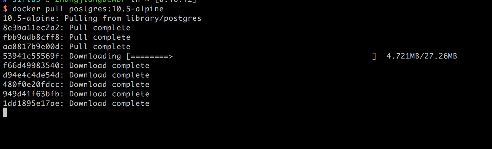
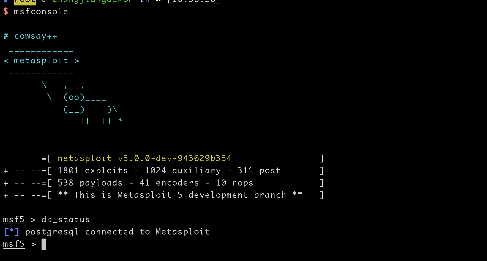

## 0x00 介绍

Metasploit是一款用ruby语言写的渗透测试工具，他的数据库用的是postgres。现在用docker很火的，我决定安装Metasploit也用一下Docker，其实metasploit官方就提供了Docker的官方编排方案，但是如果全部封装到docker里面可能会有一些问题，所以我决定源码还是在物理机上存储，数据库放到docker里面


## 0x01 安装数据库Postgres

Mac上的神器homebrew提供了docker的安装文件，安装docker只需要两条命令
```
/usr/bin/ruby -e "$(curl -fsSL https://raw.githubusercontent.com/Homebrew/install/master/install)"
brew cask install docker
brew install docker-compose

```



编排postgres

docker-compose.yml

```
version: '3.1'
services:
  postgres:
    image: postgres:10.5-alpine
    restart: always
    environment:
      POSTGRES_PASSWORD: shadow
    ports:
      - 127.0.0.1:5432:5432
    volumes:
      # Path to store DATA
      - ./data:/var/lib/postgresql/data
```

创建系统

```
mkdir data
docker-compose up -d 
```

创建新的账户和数据库

```
docker exec -it --user=postgres c35a3a722652  sh
createuser msf -P
createdb -O msf Metasploit
```


## 0x02 配置Metasploit源码

安装ruby
```
brew install rbenv ruby-build git libpq
git clone https://github.com/rapid7/metasploit-framework.git
rbenv install 2.5.1
echo 'export PATH="/usr/local/opt/libpq/bin:$PATH"' >> ~/.zshrc
```

在.zshrc下面添加

```
export PATH="$HOME/.rbenv/bin:$PATH"
eval "$(rbenv init -)"
```
新开一个终端

```
rbenv global 2.5.1
cd /usr/local/share/metasploit-framework
gem install bundler
bundle install 

```

## 0x03 配置数据库

```
cd /usr/local/share/metasploit-framework/config
cp database.yml.example database.yml
```


配置环境变量
```
ln -s /usr/local/share/metasploit-framework/msf* /usr/local/bin/
```



