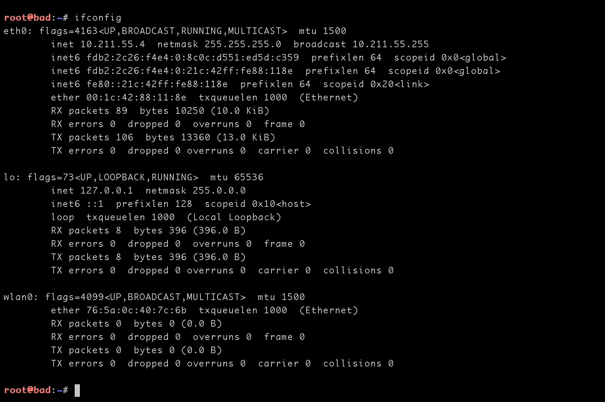
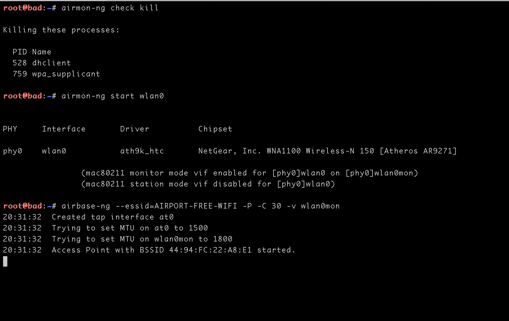

## 0x00 钓鱼热点介绍

钓鱼WIFI是一个持久的安全话题，今天测试一下

基本环境:
1. 网卡:Netgear WNA1100
2. 操作系统:Kali Rolling

首先看一下网口环境


eth0是有线网口，用来连接网络的，wlan0就是用来做热点的无限网卡

kali默认已经安装了aircrack-ng，还需要做dhcp服务的isc-dhcp-server和提供dns服务的dnsmasq

```
apt-get install isc-dhcp-server dnsmasq
```

## 0x01 配置无线热点

利用airbase-ng开启热点

```
airmon-ng check kill
airmon-ng start wlan0
airbase-ng --essid=AIRPORT-FREE-WIFI -P -C 30 -v wlan0mon 
```





编辑_etc_dhcp/dhcpd.conf,最后添加
```
authoritative;

default-lease-time 700;
max-lease-time 8000;

subnet 10.0.0.0 netmask 255.255.255.0 {
option routers 10.0.0.1;
option subnet-mask 255.255.255.0;

option domain-name-servers 10.0.0.1;

range 10.0.0.10 10.0.0.100;

}
```


为热点提供dhcp服务
```
ifconfig at0 up
ifconfig at0 10.0.0.1 netmask 255.255.255.0
route add -net 10.0.0.0 netmask 255.255.255.0 gw 10.0.0.1
dhcpd -cf /etc/dhcp/dhcpd.conf -pf /var/run/dhcpd.pid at0
```


## 0x02  配置dns服务器
dns服务由dnsmasq提供，这边需要编辑_etc_dnsmasq.conf的文件

1. 取消 resolv-file=_etc_resolv.dnsmasq.conf的注释，表示dnsmasq 会从这个指定的文件中寻找上游dns服务器。同时取消 strict-order 前面的注册#号。
```
    44  # Change this line if you want dns to get its upstream servers from
    45  # somewhere other that /etc/resolv.conf
    46  resolv-file=/etc/dnsmasq.resolv.conf
    47
    48  # By  default,  dnsmasq  will  send queries to any of the upstream
    49  # servers it knows about and tries to favour servers to are  known
    50  # to  be  up.  Uncommenting this forces dnsmasq to try each query
    51  # with  each  server  strictly  in  the  order  they   appear   in
    52  # /etc/resolv.conf
    53  strict-order
```
2. 删除addn-hosts前的注释#号，通过这个文件可以操控域名解析
```
   126  # If you don't want dnsmasq to read /etc/hosts, uncomment the
   127  # following line.
   128  #no-hosts
   129  # or if you want it to read another file, as well as /etc/hosts, use
   130  # this.
   131  addn-hosts=/etc/dnsmasq.hosts
```
 
3. 设置：listen-address=127.0.0.1，表示这个 dnsmasq 本机自己使用有效。注意：如果你想让本机所在的局域网的其它电脑也能够使用上Dnsmasq，应该把本机的局域网IP加上去：
```
111 listen-address=10.0.0.1,127.0.0.1
```


3. 修改dns解析文件
```
echo 'nameserver 114.114.114.114' > /etc/dnsmasq.resolv.conf
echo '192.168.1.6 www.baidu.com' > /etc/dnsmasq.hosts
#然后就可以启动dnsmasq
service dnsmasq start
#启动dhcp
service isc-dhcp-server start
```

## 0x03 配置流量转发

要想让连接热点的客户端删上网，需要把wlan0的流量牵引到eth0上

```
sudo sh -c "echo 1 > /proc/sys/net/ipv4/ip_forward"
sudo iptables -t nat -A POSTROUTING -o eth0 -j MASQUERADE  
sudo iptables -A FORWARD -i eth0 -o wlan0 -m state --state RELATED,ESTABLISHED -j ACCEPT  
sudo iptables -A FORWARD -i wlan0 -o eth0 -j ACCEPT
```


