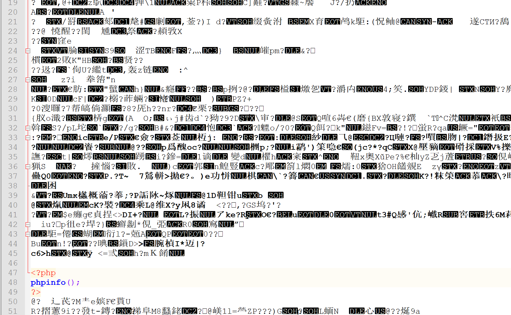
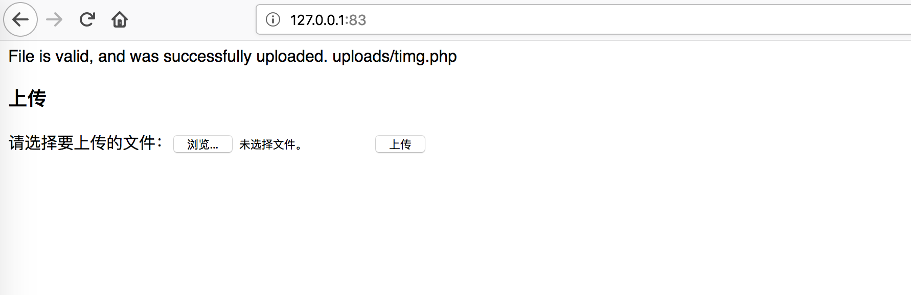
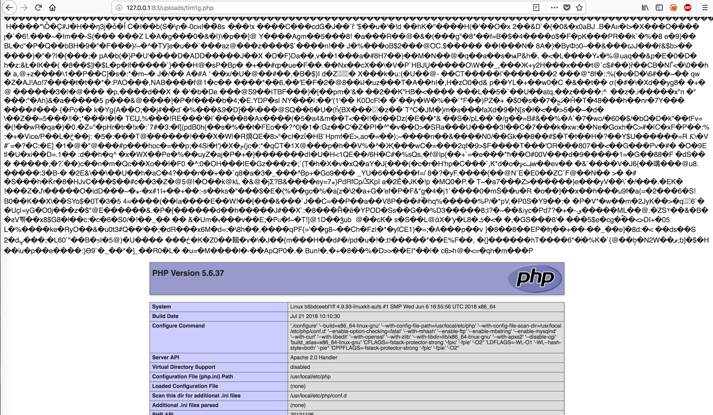
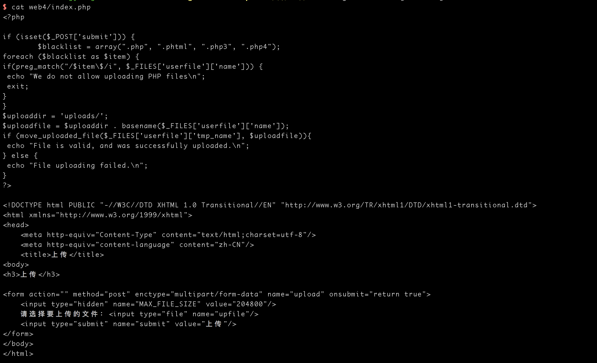
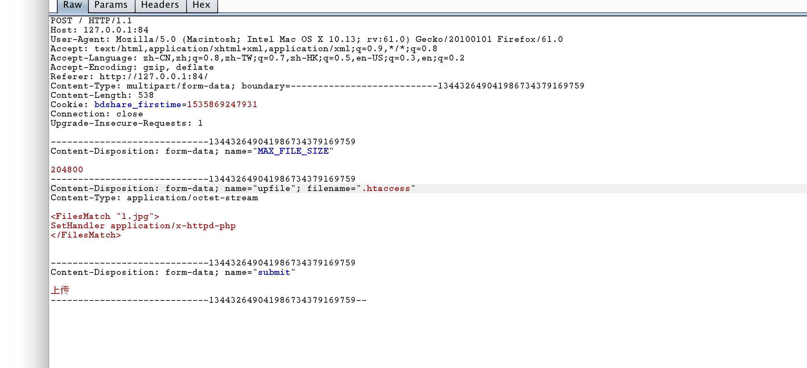
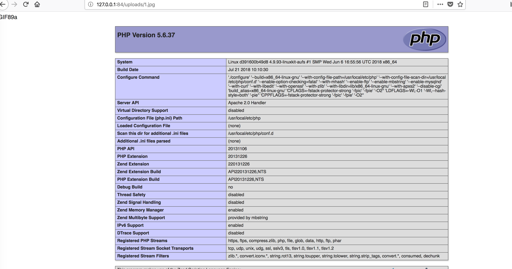
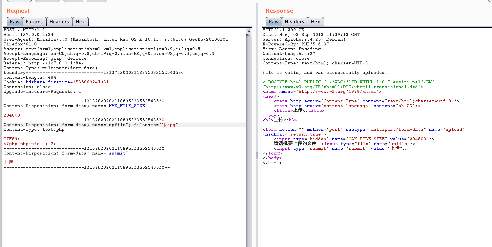
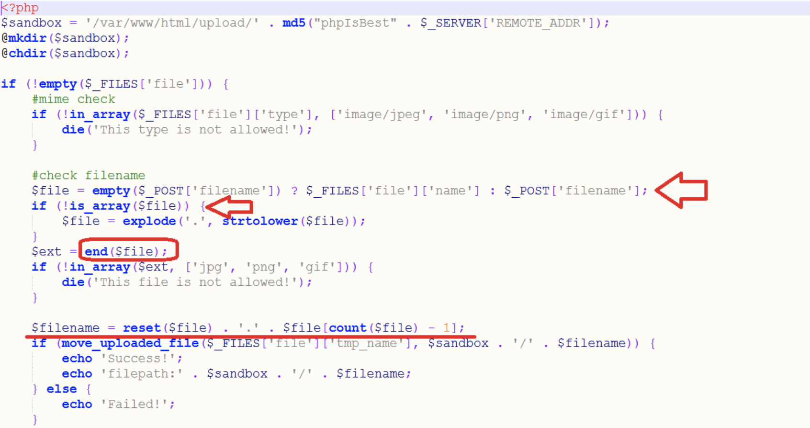
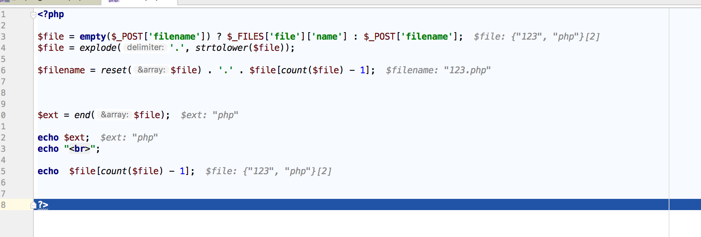
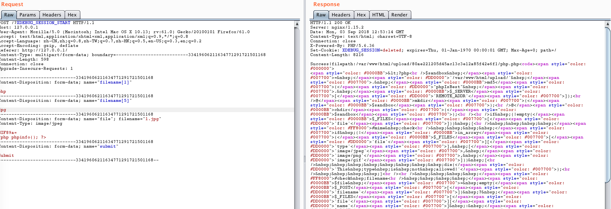

## 环境搭建

```
cd src
docker-compose build 
docker-compose up -d
```


## 0x01 基于js的文件上传绕过
看一下代码


这个上传是基于js的文件验证,js的验证是非常不安全的，可以利用burp进行绕过

首先准备一个php木马,然后配置burpsuite进行拦截，篡改


即可上传成功


## 0x02 基于Content-Type的上传验证

先看一下代码


这段代码从http请求头中的Content-Type进行验证
而Content-Type是可以通过burp修改的,新建一个后缀为php的木马
然后上传用burp拦截


## 0x03 基于文件头的校验

源码所示


该方法通过读取文件头中文件类型信息，获取文件类型

绕过的话也很简单，只要找一个正常的gif图片，然后用notepad++打开，再写入代码



然后将后缀改成php


然后就可以访问了



## 0x04 基于黑名单的校验

 首先上代码


这样看下来，在黑名单里的有 php phtml php4 php3 .这个可以利用没在名单的后缀，比如说php5进行测试，我这边选择是另一种方式，利用.htaccess进行重写,要想利用这种方式，中间件必须启用路由重写

上传先上传一个名为.htaccess文件，内容如下：
```
<FilesMatch "1.jpg">
SetHandler application/x-httpd-php
</FilesMatch>
```

然后在上传一个jpg文件






## 0x05 wafUpload
这是2018年问鼎杯第二场比赛的题目




第一个判断MIME就是content-type是不是image/jpeg，在burp中抓包直接改掉即可。

第二个判断比较关键，判断扩展名是否是jpg、png、gif

问题出在代码是如何获取扩展名的。

1、首先，文件被上传时，判断是否POST了filename字段，如果有，就把$file变量直接赋值为POST上来的值，可以是数组。
果没有POST该字段，$file变量取上传时的name，即$_FILES[‘file’]['name']

2、若$file文件名不是数组，就对字符串中的点号. 进行explode分割，分割成数组

如上传aa.bb.php会被切为

[0]  = > 'aa'
[1] => 'bb'
[2] => 'php'

这样的数组

3、获取扩展名代码

$ext = end($file);
利用了end函数，这个函数可以返回数组的最后一项。
也就返回了最后的php作为$ext，再经过判断ext是否是jpg、png、gif的一种。

这种代码验证是非常安全的，问题在于在生成最终上传文件名时，没有用同样的方法获取扩展名
```
$filename = reset($file) . '.' . $file[count($file) - 1];
```

其中，获取扩展名的代码是
$file[count($file) - 1]
取$file数组下标的最后一项。

验证扩展名和拼接扩展名的方式不一致会有问题吗？
会！
因为数组啊不仅有序列数组，还有键值型数组。会让end($file)获取的结果和$file[count($file) - 1]获取的结果不一样

如果是正常的情况，传递filename=123.php


然后我们传递
```
filename[1]=php&filename[5]=jpg
```





