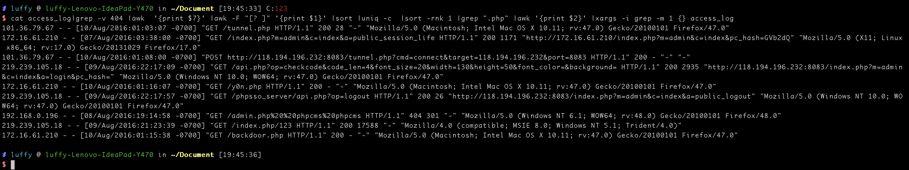

文件附件在

[百度网盘 请输入提取码](https://pan.baidu.com/share/init?surl=bq9Zvun)
密码：wabt 解压密码：t3sectimu

## 日志分析
解压之后找到 铁人三项赛样题_日志文件_phpcms_httpd_access_log
考虑到有大量的文件探测的请求，那就先把非404的请求找出来

```shell
cat access_log|grep -v 404
```

然后把http的url找出来
```shell
cat access_log|grep -v 404 |awk  '{print $7}'
```

选出的路径有的有参数，有的没有，我们只需要数据

```shell
cat access_log|grep -v 404 |awk  '{print $7}' |awk -F "[? ]" '{print $1}'
```


排序计数
```shell
cat access_log|grep -v 404 |awk  '{print $7}' |awk -F "[? ]" '{print $1}' |sort |uniq -c
```


然后就是这样
```shell
cat access_log|grep -v 404 |awk  '{print $7}' |awk -F "[? ]" '{print $1}' |sort |uniq -c  |sort -rnk 1 |grep ".php"
```


其中看起来最危险的就是

```shell
/tunnel.php
/y0n.php
/backdoor.php
```

然后就是找到这三个数据以便获取查看谁是被最早植入的

```shell
cat access_log|grep -v 404 |awk  '{print $7}' |awk -F "[? ]" '{print $1}' |sort |uniq -c  |sort -rnk 1 |grep ".php" |awk '{print $2}' |xargs -i grep -n  -m 1 {} access_log
```




最早的就是这个

101.36.79.67 - - [10/Aug/2016:01:03:07 -0700] "GET /tunnel.php HTTP/1.1" 200 28 "-" "Mozilla/5.0 (Macintosh; Intel Mac OS X 10.11; rv:47.0) Gecko/20100101 Firefox/47.0"

查看上下文


然后对IP地址排序


101是之前黑客的ip之一，172的是内网，然后是 219.239.105.18

查看了一下发现大量的POST包


在09/Aug/2016:23:02:26 -0700 爆破成功登录了后台

web日志无法获取post 参数，如果想进一步测试的话需要分析pcap包了
，这个pcap包超过3G，用wireshare分析是不明智的，
```shell
pip install httpcap
```


利用一下脚本转换成文本
```shell
for file in `ls *.pcap`
do
    parse-pcap -i 219.239.105.18  -vv $file >> txt/$file.txt
done

```


用来切分pcap的包

```
editcap -c num sourcefile destfile 
```


文件监控

转换成elf文件 

pyinstaller -F *py

```

# !/usr/bin/env python
# -*- coding: utf-8 -*-

import os
import argparse
from pyinotify import WatchManager, Notifier, ProcessEvent
from pyinotify import IN_DELETE, IN_CREATE, IN_MOVED_TO, IN_ATTRIB
import datetime


class EventHandler(ProcessEvent):
    """事件处理"""

    # 创建
    def process_IN_CREATE(self, event):
        print("[!] Create : " + event.pathname)
        print(datetime.datetime.now().strftime('%Y-%m-%d %H:%M:%S.%f'))
        DeleteFileOrDir(event.pathname)

    # 删除
    def process_IN_DELETE(self, event):
        print("[!] Delete : " + event.pathname)
        print(datetime.datetime.now().strftime('%Y-%m-%d %H:%M:%S.%f'))

    # 文件属性被修改，如chmod、chown命令
    def process_IN_ATTRIB(self, event):
        print("[!] Attribute been modified:" + event.pathname)
        print(datetime.datetime.now().strftime('%Y-%m-%d %H:%M:%S.%f'))

    # 文件被移来，如mv、cp命令
    def process_IN_MOVED_TO(self, event):
        print("[!] File or dir been moved to here: " + event.pathname)
        print(datetime.datetime.now().strftime('%Y-%m-%d %H:%M:%S.%f'))
        DeleteFileOrDir(event.pathname)


def DeleteFileOrDir(target):
    if os.path.isdir(target):
        fileslist = os.listdir(target)
        for files in fileslist:
            DeleteFileOrDir(target + "/" + files)
        try:
            os.rmdir(target)
            print("     >>> Delete directory successfully: " + target)
            print(datetime.datetime.now().strftime('%Y-%m-%d %H:%M:%S.%f'))
        except:
            print("     [-] Delete directory failed: " + target)
            print(datetime.datetime.now().strftime('%Y-%m-%d %H:%M:%S.%f'))

    if os.path.isfile(target):
        try:
            os.remove(target)
            print("     >>> Delete file successfully" + target)
            print(datetime.datetime.now().strftime('%Y-%m-%d %H:%M:%S.%f'))
        except:
            print("     [-] Delete file filed:  " + target)
            print(datetime.datetime.now().strftime('%Y-%m-%d %H:%M:%S.%f'))


def Monitor(path):
    wm = WatchManager()
    mask = IN_DELETE | IN_CREATE | IN_MOVED_TO | IN_ATTRIB
    notifier = Notifier(wm, EventHandler())
    wm.add_watch(path, mask, rec=True)
    print('[+] Now Starting Monitor:  %s' % (path))
    while True:
        try:
            notifier.process_events()
            if notifier.check_events():
                notifier.read_events()
        except KeyboardInterrupt:
            notifier.stop()
            break


if __name__ == "__main__":
    parser = argparse.ArgumentParser(
        usage="%(prog)s -w [path]",
        description=('''
            Introduce：Simple Directory Monitor!  by ssooking''')
    )
    parser.add_argument('-w', '--watch', action="store", dest="path", default="/var/www/html/",
                        help="directory to watch,default is /var/www/html")
    args = parser.parse_args()
    Monitor(args.path)
```


