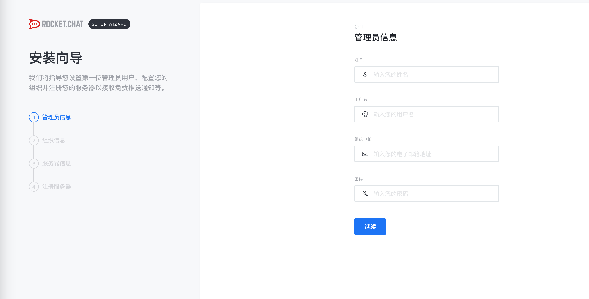

## 0x01 简介
我一直想搭建一个私有的聊天系统，恰好朋友推荐了Rocket.Chat，那就试一下
空间从搬瓦工买的，域名从godady买的，然后域名的地址指向空间地址


## 0x02 安装Rocket.Chat
```shell
apt-get update && apt-get iupgrade 
sudo snap install rocketchat-server
```

查看Rocket.Chat状态
```shell
 service snap.rocketchat-server.rocketchat-server status
```

启动之后直接访问3000端口



## 0x03 配置nginx反代和ssl

```shell
sudo apt install nginx
sudo systemctl enable nginx
```

编辑 _etc_nginx_sites-available_default(example.com改成相应的域名)

```shell
server {
    listen 80;

    server_name s1r1u5.com;

    location / {
        proxy_pass http://localhost:3000/;
    }
}
```


创建加密方案,用的是Let's Encrypt已经发布的工具certbot[Certbot](https://certbot.eff.org/)
```shell
sudo apt-get update
sudo apt-get install software-properties-common
sudo add-apt-repository ppa:certbot/certbot
sudo apt-get update
sudo apt-get install python-certbot-nginx
sudo certbot --nginx
```


[Installing Rocket.Chat on Ubuntu 16.04](https://www.linode.com/docs/applications/messaging/installing-rocketchat-ubuntu-16-04/)